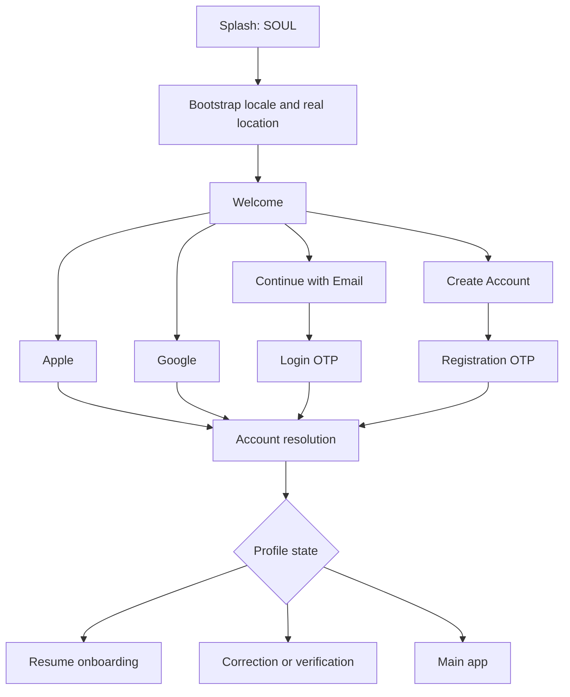
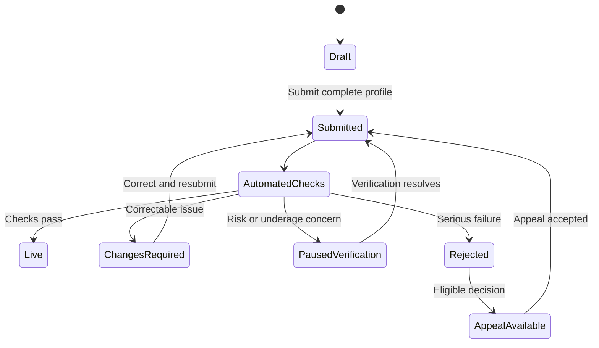
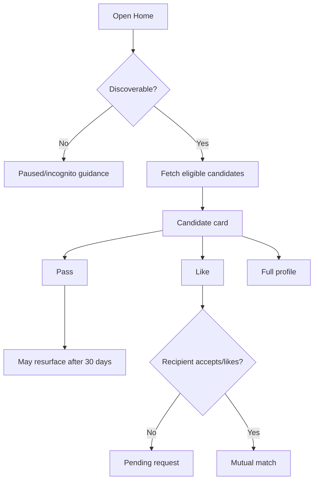
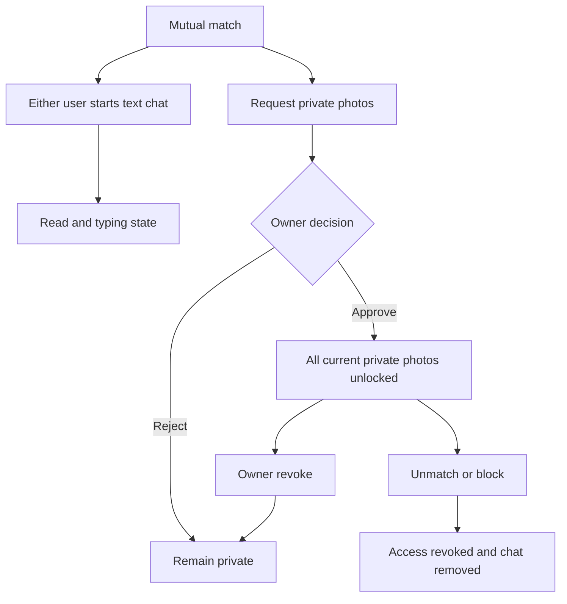

# SOUL V1 app flow

This document is the screen and state-flow source for Flutter, backend and QA. Product behavior comes from `docs/Soul_V1_Product_Requirements.md`; API availability is tracked in `BACKEND_SCOPE.md`.

## Entry, locale and authentication

Language is detected on first launch and remains user-changeable. Laravel returns catalog values and direction. Location must be resolved from real provider/device input or manually selected; no default city/country is allowed.

For a junior developer: first call bootstrap, save `translations.values`, then build the first screen. Do not write English/Urdu conditions inside individual widgets. Changing the selected language should fetch bootstrap again and rebuild the app without logging the user out.

## Onboarding screens

The client saves a draft after each meaningful step. It may combine presentation screens, but it must preserve these data decisions:

1. First name.
2. Date of birth with worldwide 18+ validation.
3. Gender: Man or Woman.
4. Current city/country from resolved or manual selection.
5. Nationality.
6. Religion/belief, then only available hierarchy levels: sect/tradition, sub-sect/school/movement and optional caste/community.
7. Required marital status.
8. One or more visible intentions: Marriage, Serious relationship, Casual dating.
9. Profession/status and optional job/employer/education.
10. At least one spoken language.
11. Required smoking, alcohol, current-children and future-children answers, each supporting Prefer not to say.
12. Optional bio, height, grew-up-in, ethnic origin, relocation, interests (max 15), traits (max 5), family involvement and religion-specific answers.
13. Up to three photos: position 1 public cover; positions 2–3 public/private; at least one approved clear face.
14. Push explanation, permission choice and notification categories; marketing defaults off.
15. Neutral legal promises, Terms and Privacy acceptance with versions.
16. Readiness, submission and automated checks.

Every non-live state must include a specific reason and correction route. Human review is for risk, reports and disputes, not every profile.

## Main navigation

| Tab | Primary surfaces | Important states |
|---|---|---|
| Home | Discovery card, full profile, filters | Loading, empty, paused, incognito, exhausted |
| Explore | Incoming activity, likes/requests, events | Pending, accepted, declined, registered |
| Chat | Requests, matches, conversations | Pending request, active match, unmatched, blocked |
| Profile | Edit profile, photos, verification, plan, settings | Draft/correction, live, paused, deletion scheduled |

## Discovery flow

The default audience is opposite gender and My Religion. The user can change the persistent religion mode to All Religions and apply supported age, radius, location, intention and other V1 filters as they become available.

Marital status and intentions remain prominent. Age is always visible. Exact location is never exposed; only backend-provided distance bands may be shown. Inactive profiles rank lower after 30 days and disappear after 90 days.

## Match, chat and private photos

Pending requests do not expire. V1 chat is text/emoji only. Online/last-seen and typing are visible when their backend phase is complete. Unmatch removes the conversation for both users and revokes private-photo access.

## Safety flow

- Block immediately stops discovery and interaction.
- Report offers Report only or Report & Block.
- Underage suspicion pauses the reported profile and starts age/ID verification.
- Risk scoring may temporarily hide a profile; serious/disputed cases enter a moderator queue.
- A banned user receives one proper appeal path when eligible.
- Safety actions and appeals can never be paywalled.

## Events flow

Admin creates/approves an online or physical event with date, city, capacity and attendee privacy. Users browse details, join if capacity/eligibility allows, leave, and report an event. Public user-created events are deferred.

## Subscription flow

Flutter receives effective capabilities and limits from bootstrap/account configuration, presents store products mapped by backend plan, completes Apple/Google purchase, then refreshes entitlements. Flutter never hard-codes free/paid allocation, limits, rollout percentages or prices.

## Settings and account lifecycle

- Language and direction.
- Active login devices and remote sign-out.
- Push/email category preferences; marketing separate and off by default.
- Screenshot protection default on.
- Profile pause/incognito/contact hiding when available.
- Account data export.
- Account deletion confirmation, immediate discovery pause and 30-day recovery window.
