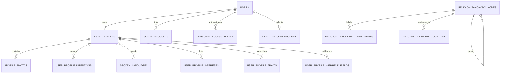
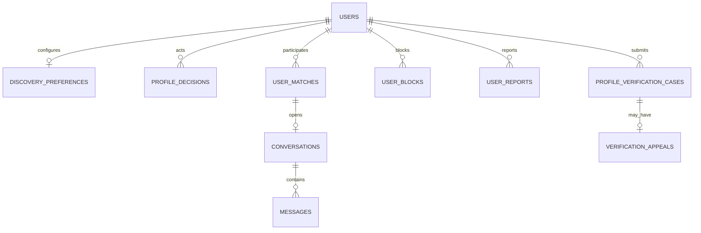
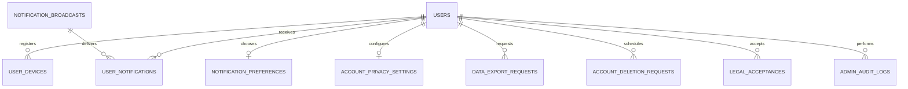

# SOUL V1 database design

This document describes the current Laravel schema and the planned V1 domain extensions. Migrations remain the executable source of truth. Numeric keys are internal; public API resources use ULIDs.

## Design rules

- Foreign keys enforce ownership and cleanup; safety/audit history uses restrictive or nulling behavior where deletion must not erase accountability accidentally.
- Public IDs prevent sequential-ID enumeration.
- Provider secrets/tokens are encrypted or hidden; stable hashes support duplicate detection without returning raw values.
- Exact coordinates and private provider asset IDs are never exposed to clients.
- Catalog/taxonomy labels are normalized for multilingual administration.
- High-volume feeds use cursor pagination and composite indexes matching access patterns.
- Destructive migrations and production data rewrites require a separate reviewed rollout plan.

## Current domain map

## Current tables by ownership

| Domain | Tables | Ownership/constraints |
|---|---|---|
| Identity | `users`, `social_accounts`, `email_verification_codes`, `personal_access_tokens` | Unique email/public ID/provider identity; account cascades identities and tokens |
| Profile | `user_profiles`, `user_profile_intentions`, `spoken_languages`, `spoken_language_user_profile`, `user_profile_interests`, `user_profile_traits`, `user_profile_withheld_fields` | One profile per user; normalized multi-select intentions/languages; bounded interests/traits; explicit optional answer state |
| Religion | `religion_taxonomy_nodes`, `religion_taxonomy_translations`, `religion_taxonomy_countries`, `user_religion_profiles` | Hierarchical path, localized labels, country availability, selected leaf plus denormalized V1 root per user |
| Photos | `profile_photos`, `profile_photo_uploads` | Slots 1–3 unique per profile; provider asset globally unique; short-lived upload sessions |
| Lifecycle/legal | `profile_status_transitions`, `legal_acceptances` | Append-style state history and versioned consent |
| Discovery | `discovery_preferences`, `discovery_preference_locations`, `discovery_preference_intentions`, `profile_decisions`, `user_matches` | One preference row; normalized multi-location/intention filters; one current decision per actor/target; normalized match pair |
| Chat/safety | `conversations`, `messages`, `user_blocks`, `user_reports` | One conversation per match; indexed message feed; directional blocks and review queue |
| Verification | `profile_verification_cases`, `verification_appeals` | Multiple cases per user; at most one appeal per case |
| Notifications | `user_devices`, `notification_preferences`, `user_notifications`, `notification_broadcasts` | Encrypted token plus unique hash; one preference row; idempotent broadcast recipient |
| Privacy | `account_privacy_settings`, `hidden_contact_hashes`, `data_export_requests`, `account_deletion_requests` | One settings row; keyed non-reversible contact hashes; export/deletion lifecycle rows |
| Admin/operations | `admin_audit_logs`, user `admin_role` | Restricted admin actor deletion and immutable operation evidence |
| Infrastructure | `cache`, `cache_locks`, `jobs`, `job_batches`, `failed_jobs` | Laravel cache, locks and asynchronous work |

## Critical indexes and invariants

- Candidate discovery indexes lifecycle, gender, country, birth date and activity-oriented filters.
- `profile_decisions_visibility_expiry_index` supports permanent like exclusion and 30-day pass expiry.
- `user_religion_root_user_index` supports V1 My Religion filtering without deep-tree joins.
- Profile activity and coordinate indexes support inactivity ordering and radius bounding-box scans.
- Match member IDs are stored in normalized order with a unique pair.
- Messages use `(conversation_id, id)` for cursor reads.
- Notifications use `(user_id, read_at, id)` for unread feeds.
- Reports and verification cases index status/time for moderator queues.
- Deletion requests index status/scheduled time for cleanup jobs.
- Audit events index subject and actor/time; audit public IDs are unique.

Application/database checks jointly enforce photo slot range, profile enum values, age eligibility at submission, active-account access, country-aware taxonomy paths and non-enumerating interaction visibility.

## Planned V1 schema extensions

These are required by the confirmed PRD but are not represented by complete current migrations yet:

| Phase | Planned storage |
|---|---|
| Private photos | Access requests, grants, decisions, revocation timestamps and match ownership |
| Chat presence | Presence/last-seen and ephemeral typing state (cache preferred for typing) |
| Safety | Risk signals/actions, moderation cases, ban appeals and report action linkage |
| Notifications | Separate push/email channel preferences and consent timestamps |
| Events | Events, localized details, registrations, capacity counters and reports |
| Subscription | Features, plans, products, entitlements, limits/counters, country overrides, promotions, rollouts and user overrides |
| Legal | Community-guideline acceptance and versioned policy/commitment records where not covered by current document types |

Each extension must include reversible migrations, foreign keys, production-safe indexes, factories and model/API tests. Pricing and exact plan allocation remain configuration data, not schema constants.

## Data retention and security

- Deletion remains recoverable for 30 days, then a queued job permanently removes eligible account data.
- Data exports are private, expiring artifacts on a configurable non-public disk.
- Admin audit evidence must not contain secrets, OTPs, provider tokens, message bodies or raw identity documents.
- Contact discovery should store normalized keyed hashes, not a reusable address book.
- Exact location requires restricted storage, retention and access logging before its discovery phase ships.
- Backup/restore, retention and regional compliance are deployment gates, not assumptions encoded in Flutter.
