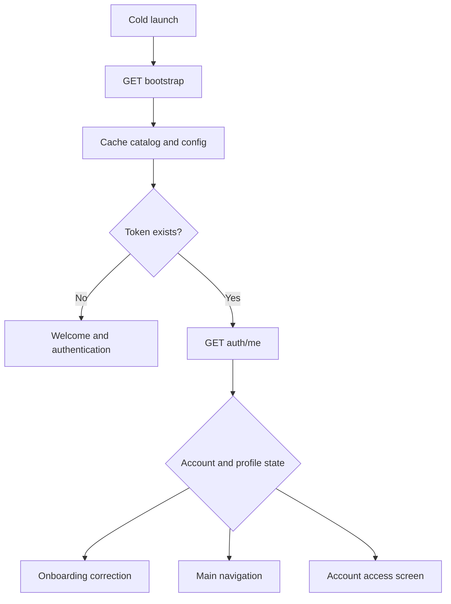

# SOUL V1 Flutter developer guide

This is the implementation guide for the Android/iOS client. Laravel is the authority for authentication, eligibility, visibility, moderation, entitlements and localized UI copy. Flutter should render server state and must not reproduce business rules locally.

## Start here

1. Read `APP_FLOW.md` for screen order, branches and lifecycle states.
2. Read `FLUTTER_API_HANDOFF.md` for all versioned routes and stable enums.
3. Read `PROFILE_INFORMATION_CONTRACT.md` before building onboarding/profile forms.
4. Read `RELIGION_DISCOVERY_CONTRACT.md` before building religion or discovery-mode screens.
5. Import `contracts/openapi-v1.json` or `contracts/postman-v1.collection.json` while building the API client.
6. Read `DATABASE_DESIGN.md` only to understand ownership and relationships; Flutter never uses internal database IDs.
7. Read `BACKEND_SCOPE.md` before implementing a screen so unfinished gap-closure modules are not mistaken for available APIs.

## Client architecture

Use feature-first modules with four shared layers:

- `core/network`: base URL, bearer-token interceptor, request ID capture and error-envelope parsing.
- `core/localization`: bootstrap catalog cache, locale selection, fallback and text direction.
- `core/session`: secure token storage, current account and active-device state.
- `core/navigation`: route guards driven by account/profile lifecycle returned by Laravel.

Recommended feature modules are auth, onboarding, discovery, activity, matches, chat, photos, verification, safety, notifications, events, subscription and settings. Repository/domain abstractions should depend on generated or strongly typed API DTOs, not JSON maps passed through widgets.

## App startup



- Call `GET /api/v1/bootstrap` on first launch and when the cached translation/config version changes.
- Send `Accept-Language`. Store the user's explicit locale separately from device-detected locale.
- Store bearer tokens only in Keychain/Keystore-backed secure storage.
- A 401 clears the local session. A 403 renders the returned account restriction. A 409 follows the returned correction/state contract.
- Preserve `X-Request-ID` with client logs and support reports, but never log tokens, OTPs, message bodies or private media URLs.

## Localization contract

- Laravel JSON catalogs are the source of truth. Do not hard-code user-facing production copy in Flutter.
- `brand.name` is deliberately absent: render `SOUL` as a non-translatable brand asset/string.
- Apply `data.locale.direction` globally before rendering the localized route.
- Cache by `translations.version` plus `translations.hash`; retain the last valid catalog for offline startup.
- If a key is absent in a newly added client screen, show the server-provided English fallback and report the missing key in non-sensitive telemetry.
- Locale switching must rebuild navigation, validation copy, dates and layout direction without signing the user out.

### Simple Flutter example

```dart
final values = bootstrap.translations.values;

Text(values['profile.first_name'] ?? 'First name');
```

Keep one small translation helper around this lookup. Widgets should request a key such as `profile.first_name`; they should not contain separate English and Urdu sentences. English and simple Roman Urdu cover all current V1 feature areas. Other configured catalogs safely use English for newly added keys until their human-reviewed translations are ready.

## API rules

- Base prefix: `/api/v1`.
- Use only public ULIDs exposed as `id`; never persist numeric database IDs.
- Parse the standard `success`, `message`, `data`, `error` and `meta.request_id` envelope.
- Cursor pages are append-only in the UI. Return the opaque `next_cursor` unchanged.
- Treat 429 as retryable using `Retry-After`; use bounded exponential backoff for network errors.
- Retry idempotent GET/PUT/DELETE requests safely. Do not automatically replay non-idempotent POST requests unless their endpoint explicitly documents idempotency.
- Server authorization is final even if a control is hidden in Flutter.

## Authentication implementation

- Registration and login email OTP flows are separate. Keep `verification_id` only for the active flow.
- Google/Apple identity tokens go directly to Laravel; never trust provider profile data as an authenticated local session.
- Use `GET /auth/me` after token issue and on resume.
- Logout revokes the current token; logout-all revokes every mobile session.
- Device/push registration happens only after notification permission is answered. Permission denial must not block onboarding.

## Onboarding implementation

Persist each screen with partial profile updates and resume from server state. Required completion is determined only by `/onboarding/readiness`.

Use `PROFILE_INFORMATION_CONTRACT.md` for field names, enums, collection limits and the important difference between Skip and Prefer not to say. Model optional answers as three states instead of using one nullable string for everything.

- Location: attempt device permission, call `/location/resolve`, and offer manual city selection when unavailable. Never insert a default city.
- Religion: fetch country-aware options, traverse only returned children, skip absent layers and save the complete selected path.
- Religion discovery: default to the returned `my_religion` mode and offer `all_religions`; never add a sect filter in V1.
- Photos: request a signed upload session, upload directly to Cloudinary, then register the exact response. Show upload, pending, approved, rejected and replacement states.
- Submission: use readiness to focus the first missing/correction screen, then submit. Poll or refresh `/onboarding/status` after automated checks.
- Do not assume selfie/phone verification is required for every user; follow the returned risk/profile state.

## Discovery and interaction

- Candidate cards display calculated age; date of birth never appears.
- Never calculate or display exact coordinates. Render the distance band supplied by Laravel when that phase is available.
- A pass can resurface after 30 days. A like remains excluded unless withdrawn before matching when the withdrawal API is added.
- Treat profile/match 404 responses as non-enumerating unavailable states.
- Read receipts are always on. Call `POST /matches/{match}/messages/read` when received messages become visible.
- V1 chat accepts text and emoji only. Do not expose photo, audio or calling controls.

## Private media and safety

- Never reveal provider asset identifiers.
- Private-photo URLs/access must come from the backend after a mutual match and approval; do not cache beyond the server grant.
- Apply Android secure-window behavior and iOS masking/detection/watermark behavior where supported, without promising impossible prevention.
- Report and block actions must remain available regardless of subscription.
- Reporting UI must use server enum values and offer both Report only and Report & Block when the supporting API phase is complete.

## Four-tab navigation

1. Home: discovery and filters.
2. Explore: likes/activity, events and future configured surfaces.
3. Chat: matches, requests and conversations.
4. Profile: profile editing, verification, subscription, privacy, notifications, devices, export and deletion.

Route guards should be data-driven: a profile in correction or verification pause goes to the relevant correction screen instead of main discovery.

## Release checklist for Flutter

- Contract models cover every endpoint used by the app.
- English and Roman Urdu layouts pass LTR/RTL policy defined by the bootstrap response.
- No hard-coded city, entitlement, price, report category or moderation rule.
- Token, OTP, exact location and private-media values are redacted from logs and crash reports.
- Offline and retry behavior tested for bootstrap, profile draft, upload registration and message send.
- Deep links cannot bypass onboarding, subscription or safety authorization.
- Store builds point to the intended environment and use environment-specific social/provider identifiers.
