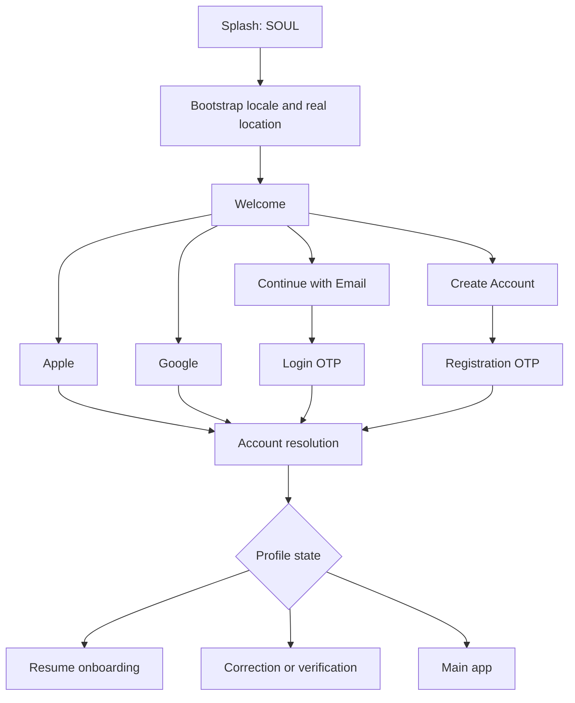
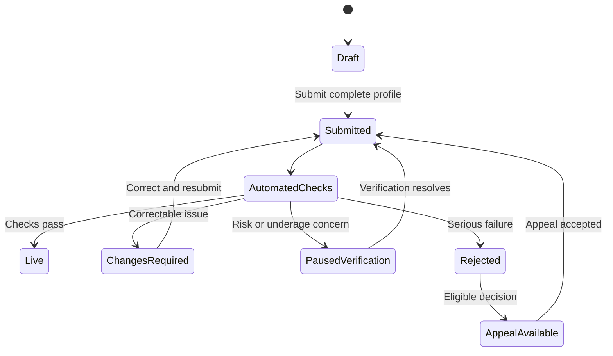
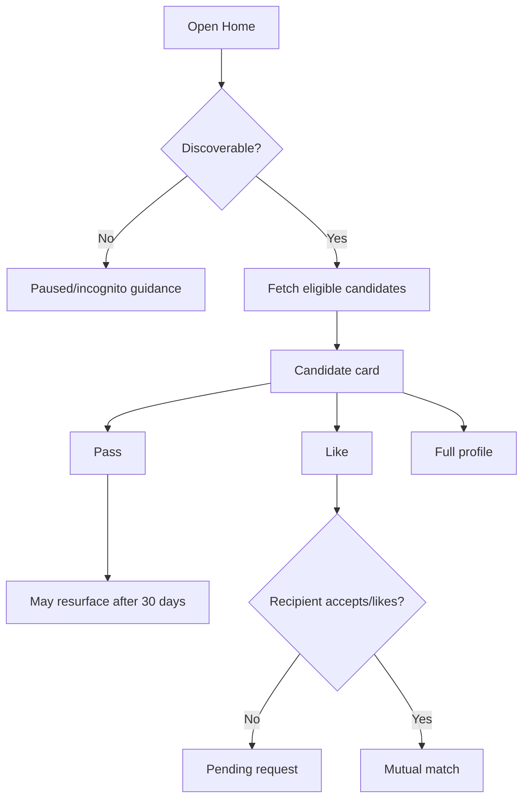
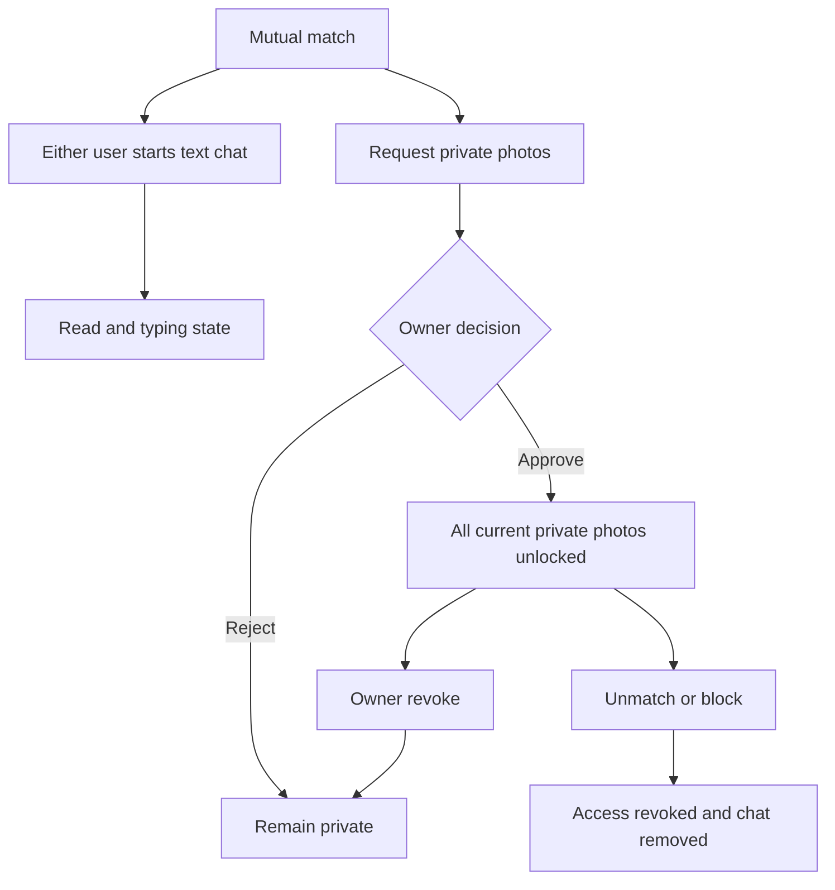
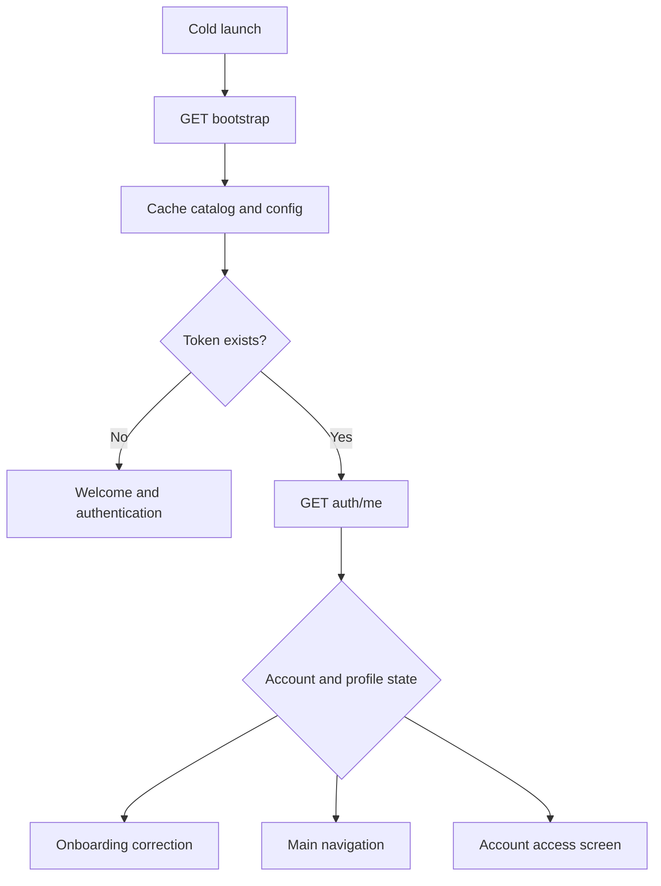
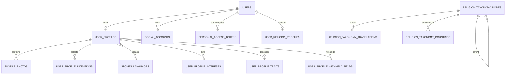
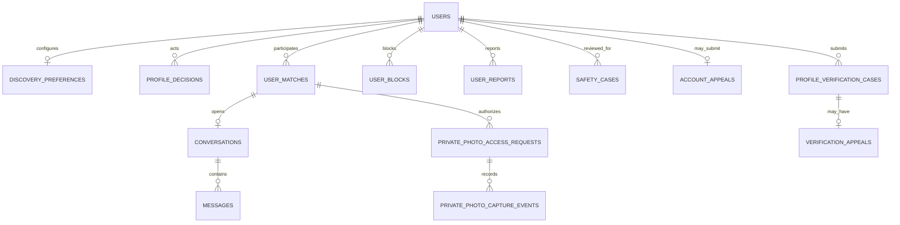
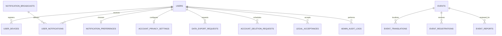

# SOUL Version 1 — Complete Product and Technical Documentation

This is the single human-readable source for SOUL Version 1. It explains the product, member experience, Flutter integration, Laravel backend, React administration, database, security and release process in one professionally ordered document.

## How to use this document

| Reader | Start with | Continue with |
|---|---|---|
| Product owner or stakeholder | Executive summary and Product requirements | Delivery progress and Complete member app flow |
| Investor or business partner | Executive summary | Product requirements, Backend scope and Release closure |
| Flutter developer | Complete member app flow | Flutter developer guide, Flutter API reference and feature contracts |
| Backend developer | Backend scope | Flutter API reference, Database design and feature contracts |
| Admin/operator | React admin operations | Safety, subscriptions, events and Production readiness |
| QA/release engineer | Product requirements | PRD traceability, Release-candidate audit and Release closure |

Machine-readable companions remain separate because development tools import them directly:

- `docs/contracts/openapi-v1.json` — OpenAPI 3.1 contract.
- `docs/contracts/postman-v1.collection.json` — importable Postman collection.

## Executive summary

SOUL is a privacy-conscious relationship and matchmaking platform for Android and iOS. The Flutter member app is backed by a Laravel API and a custom English-only React administration panel. Its distinguishing product flow combines detailed, country-aware religion taxonomy with mainstream discovery, matching, messaging, verification, safety, events and dynamically configured subscriptions.

Version 1 backend capabilities include authentication, onboarding, profile lifecycle, moderated public/private photos, discovery, likes and matches, chat, safety and appeals, notifications, events, subscriptions, privacy exports/deletion, localization delivery and audited admin operations. Software completion does not replace external launch work: production provider credentials, store configuration, legal approval, staging journeys and operational readiness must still be verified before release.

SOUL has one current backend and one current Flutter contract. `/api/v1` is the stable public URL namespace, not a second codebase or a second app. Flutter always integrates the current documented contract; internal storage formats are not exposed as competing app versions.

## Document conventions

- **Implemented** means code and automated tests exist in this repository.
- **Launch-ready** additionally requires production configuration and external verification.
- Public IDs may be shown to clients; internal database IDs and provider secrets must not be exposed.
- The member app is multilingual. The React admin interface is intentionally English-only.
- Urdu means Roman Urdu in Latin characters and left-to-right layout.

---

## Product requirements

**Status:** Confirmed product direction  
**Platform:** Flutter (Android/iOS)  
**Backend:** Laravel APIs  
**Product type:** Global multi-religion marriage and dating application

### 1. Product scope

SOUL supports three visible, multi-select intentions:

- Marriage
- Serious relationship
- Casual dating

Intentions are always visible on the profile. Discovery does not require matching intentions, although users may filter them.

The minimum age is 18 worldwide. Exact date of birth remains private; calculated age is always visible.

### 2. Authentication and accounts

- Supported sign-in methods: Apple, Google and Email.
- One user account may link Apple, Google and Email identities.
- Verified email or phone may be used to detect and safely link/merge duplicate accounts.
- Users can view active login devices and remotely sign out.
- Account deletion has a 30-day recovery period, followed by permanent deletion.
- Users can request/download their account data.

### 3. Localization and brand

- Language is detected on first launch and can be changed by the user.
- UI translations are delivered by Laravel rather than bundled as the source of truth in Flutter.
- SOUL brand name/logo is never translated.
- RTL/LTR direction is returned by the bootstrap API.
- Location shown in onboarding must come from the real resolved location; no hard-coded default city/country.

### 4. Required profile information

The following are required before a profile can go live:

- First name
- Date of birth and age eligibility
- Gender: Man or Woman
- Current city and country of residence
- Nationality
- Religion/belief
- Marital status
- At least one intention
- Profession/status
- At least one spoken language
- Smoking answer (including Prefer not to say)
- Alcohol answer (including Prefer not to say)
- Current-children answer (including Prefer not to say)
- Future-children answer (including Prefer not to say)
- One public cover photo
- At least one clear-face photo among uploaded photos; it may be private

Current city is required. If GPS permission is denied, the user manually selects it.

### 5. Optional profile information

- Bio
- Education
- Height
- Job title and employer
- Grew up in
- Ethnic origin
- Sect/tradition
- Sub-sect, school or movement
- Caste/community
- Religion-specific practice, prayer, diet and dress answers
- Relocation preference
- Interests (maximum 15)
- Personality traits (maximum 5)
- Family-involvement preference

Optional fields support both:

- **Skip:** not answered yet
- **Prefer not to say:** intentionally withheld

Detailed religion fields are shown by default on the full profile when answered, with a privacy option to hide them.

### 6. Religion taxonomy and Version 1 discovery

The database stores a future-ready hierarchy:

`Religion → Sect/Tradition → Sub-sect/School/Movement → Caste/Community`

Version 1 discovery uses religion level only:

- Default: **My Religion**
- Optional filter: **All Religions**
- A Muslim user sees all Muslim profiles by default; the equivalent applies to every religion/belief.
- Sect, sub-sect and caste are displayed on the full profile but do not affect Version 1 ranking or filtering.
- The selected religion mode persists until changed.

Deep sect-tree ranking, sect preferences and must-have religious filters are reserved for a later version.

### 7. Discovery

- Default discovery is opposite-gender matching based on the registered Man/Woman gender model.
- Core ranking may use age, location, activity and basic compatibility.
- Users may search by radius and by selected locations, including Anywhere.
- Passed profiles may appear again after 30 days.
- A Like may be withdrawn before a Match is created.
- Favourite and Compliment features are not included.
- Incognito mode is supported: only people liked by the user can discover that user.
- A user may pause their profile; existing matches/chats remain while the profile disappears from discovery.
- Users may hide accounts matching uploaded phone contacts.
- After 30 inactive days ranking is reduced; after 90 inactive days the profile is hidden from discovery.

### 8. Distance privacy

Exact coordinates, live location, exact feet and exact metres are never exposed.

Free display examples:

- Less than 1 km
- About 2 km
- About 5 km

Paid/narrow-range examples may begin at:

- Within 500 m
- 500 m–1 km
- 1–2 km
- 2–5 km
- 5–10 km
- 10+ km

Distance is rounded/cached to reduce movement tracking. The backend may calculate exact distance internally but must only return the permitted band.

### 9. Photos

- Maximum total: 3 photos.
- Photo 1 is the required public cover photo.
- Photos 2 and 3 are optional and may be public or private.
- At least one uploaded photo must contain a clear identifiable face.
- The clear-face photo may be private.
- If the cover does not pass the clear-face check, an additional clear-face photo is required before going live.
- Photos support upload progress, moderation pending, rejection reason, replacement and ordering within the permitted structure.

### 10. Private photos

- Private-photo access can only be requested after a mutual Match.
- The request is a single button with no separate reason/message field.
- The owner approves or rejects the request.
- Approval unlocks all of that owner's currently private photos for the requester.
- The owner may revoke access at any time.
- Access is automatically revoked on unmatch or block.

### 11. Screenshot protection

- The photo owner has a Screenshot Protection control, default ON.
- Private photos receive the maximum available protection.
- Android should block capture on protected screens where supported.
- iOS should use available capture detection, screen-recording masking, warnings and viewer-identifying watermarking; it must not promise technically impossible prevention.
- Screenshot notifications are best-effort only where the operating system exposes reliable signals.

### 12. Likes, requests, matches and chat

- A user can Like a profile.
- Normal chat becomes available when the recipient accepts the request/Like, creating a Match.
- After matching, either user can send the first message.
- Pending chat requests do not expire.
- Version 1 chat is text and emoji only.
- Chat photos, voice notes, audio calls and video calls are not included in Version 1.
- Read receipts are always visible.
- Online/last-seen status is visible.
- Typing indicator is enabled, with a Snapchat-like live typing experience where feasible.
- Active chats are not limited by product logic.
- Unmatching removes the conversation from both users and revokes private-photo access.

### 13. Marital status

- Marital status is required and cannot be hidden.
- A married user's status appears on both the discovery card and full profile.
- Married users may select Marriage, Serious relationship and/or Casual dating.
- Married users can be shown to unmarried users; their status remains prominent.
- Partner-consent and polygamy questions are not included.

### 14. Verification

Verification types remain separate:

- Email verification
- Phone verification (optional badge)
- Selfie/face verification (optional badge)
- ID/age verification (optional or risk/region dependent)

Phone and face verification do not block a normal profile from going live unless a safety/risk flow specifically requires verification. Underage suspicion immediately pauses the profile and requests age/ID verification.

### 15. Safety, reporting and moderation

Report categories include:

- Fake profile
- Scam
- Harassment
- Nudity/sexual content
- Underage
- False marital status
- Other

Rules:

- Reporting offers **Report only** and **Report & Block**.
- Risk scoring may temporarily hide a profile pending review; no simplistic public fixed-report threshold is required.
- Automated checks handle initial screening; serious or disputed cases go to a human moderator.
- Banned users receive one proper appeal path.
- Nudity and sexual content are prohibited in public and private profile photos.
- Screenshot/profile capture warnings are best-effort and platform-dependent.

### 16. Notifications

- Near the end of onboarding, explain push notifications and offer Allow / Not now.
- Denial does not block onboarding.
- Users choose notification categories during setup.
- Email notification categories can be controlled separately.
- Marketing consent is separate, optional and off by default.

### 17. Events

Events are included in Version 1:

- Online and physical events
- Admin-approved event publishing initially
- Event details, date, city, capacity and join/leave registration
- Attendee privacy and event reporting
- Public user-created events are deferred until moderation controls are mature

### 18. Subscription and dynamic entitlements

Version 1 supports subscription, but exact plans, prices and feature allocation will be finalized near launch.

Free/paid behavior must not be hard-coded in Flutter. Admin-configurable capabilities include:

- Feature enabled/disabled
- Free, paid or universally available
- Daily/monthly limits
- Country/region/platform availability
- Plan entitlements
- Trials and promotions
- Individual user overrides
- Scheduled start/end dates
- Percentage rollouts

Backend domains:

- Features
- Subscription plans
- Plan entitlements
- Usage limits/counters
- User entitlement overrides
- Country overrides
- Promotions
- Feature rollouts

The bootstrap/config response returns the authenticated user's effective capabilities and limits. Laravel remains authoritative for action authorization; Flutter uses the response for UI visibility and paywall presentation.

Store pricing remains mapped to valid Apple App Store and Google Play products.

These safety/account capabilities may never be paywalled:

- Block
- Report
- Account deletion
- Core privacy protection
- Safety appeals/support

### 19. Legal promise and consent

The user agrees to neutral global commitments:

- Respect everyone
- Provide identity and marital status honestly
- No harassment, scams or inappropriate behavior
- Follow Community Guidelines
- Accept Terms and Privacy Policy

Backend records document version, acceptance timestamp and appropriate IP/device context.

### 20. Profile lifecycle

Core lifecycle:

`Draft → Submitted → Automated checks → Live`

Alternative states include:

- Changes required
- Photo rejected
- More information required
- Profile paused for verification
- Profile rejected
- Appeal available

The user receives a specific reason and a link to the relevant correction screen. Human moderation is used for risk, reports and disputed cases rather than mandatory review of every profile.

### 21. Main navigation

Bottom navigation:

1. Home / Discovery
2. Explore / Activity
3. Chat
4. Profile

Supporting modules include filters, full profiles, likes/visitors, matches/chat, block/report, editing, verification, subscription/boosts, events, settings/privacy and help/support.

### 22. Explicitly deferred decisions

- Exact subscription tiers, prices, limits and paid-feature allocation
- Chat photos, audio messages and calling
- Deep sect/sub-sect/caste matching and filters
- Chaperone/guardian system (not planned for Version 1)
- Public user-created events
- Country-specific expansion details requiring legal review

### 23. Implementation principles

- Laravel is authoritative for eligibility, visibility, moderation and entitlements.
- Flutter must not rely on hidden UI as authorization.
- Every protected action is rechecked server-side.
- Configuration responses are versioned and cached with safe fallbacks for old app versions.
- Taxonomy and catalog labels are multilingual and admin-configurable.
- Privacy and safety defaults take priority over monetization.

---

## Backend scope and implementation status

This document prevents “API exists” from being confused with “the full product requirement is complete.” The confirmed product requirements are authoritative; this matrix records the current implementation boundary and the remaining gap-closure phase.

### Technology and ownership

- Laravel 13 / PHP 8.3 JSON API.
- Sanctum bearer authentication for Flutter; secure same-origin session authentication for the custom React admin.
- Relational database with migrations, foreign keys and indexed cursor feeds.
- Queued jobs for provider cleanup, exports, broadcasts and scheduled deletion.
- Cloudinary direct upload/moderation integration; Cloudflare-aware bootstrap/location boundary.
- Laravel-managed translation catalogs and dynamic configuration.
- OpenAPI 3.1 and Postman contracts generated from the maintained API handoff.

Laravel owns every protected decision. Flutter owns presentation, platform permissions and safe local caching. React admin owns operator workflows but may act only through authorized Laravel endpoints.

### Current implemented foundation

| Area | Implemented now | Remaining V1 scope |
|---|---|---|
| Bootstrap/localization | Locale negotiation, version/hash, direction, member-app catalogs and an English-only React admin interface | Human-reviewed member copy for remaining configured languages as translation work becomes available |
| Authentication | Email registration/login OTP, Apple, Google, linked social identities, current user, active-device sessions, targeted remote logout/logout-all and conservative duplicate-account merge | Live provider credential verification remains a release gate |
| Profile onboarding | Draft save/resume, all required V1 answers, optional details, interests/traits, Skip versus Prefer-not-to-say state, religion selection, readiness/lifecycle | Public full-profile presentation continues with discovery/privacy phases |
| Religion | Future-ready hierarchy, translations, complete-path country validation, saved leaf/root selection, persistent My Religion/All Religions discovery and admin taxonomy | Full-profile detailed-field presentation remains coupled to public-profile/privacy work |
| Photos | Three slots, authenticated secondary uploads, moderation, private access request/approval/revocation, protected no-store delivery, screenshot controls/signals | Provider staging verification and mobile-native protected-view implementation |
| Discovery | Gender/age/religion/intention/location/radius filters, activity ranking, 90-day hiding, safe distance bands, pass resurfacing and likes exclusion | Entitlement-dependent filter limits remain dynamic subscription work |
| Likes/matches/chat | Like/pass, incoming requests, accept/decline/withdraw, matches, summaries, unmatch, text messages, mandatory read receipts, online/last-seen, expiring typing signals and authorized private broadcast channels | Live broadcast transport configuration and staging verification |
| Verification | Separate email, phone, selfie and ID/age states; optional/required semantics; safe public badges; cases, review and one appeal | Underage escalation and broader risk automation (Phase 21) |
| Safety | Atomic Report/Report & Block, underage pause, risk cases, moderator decisions, blocked-account appeal and immutable audit | Provider-assisted risk signals can be added without changing the case contract |
| Notifications | Devices, separate push/email preferences, mandatory safety alerts, in-app feed, idempotent event creation, moderation/verification/account events and admin broadcasts | APNs/FCM and email provider credentials plus staging delivery verification |
| Events | Admin-created online/physical events, localization, publishing, capacity-safe registration, attendee privacy and report moderation | Provider-specific streaming/venue integrations are outside the V1 contract |
| Subscriptions | Dynamic features, plans, limits/counters, country/platform/user overrides, rollouts, trials/promotions and store-product catalog | Apple/Google credentials and server receipt-notification validation are staging/release gates; exact prices and allocations remain launch decisions |
| Privacy/account | Settings, screenshot protection, profile pause, incognito, keyed contact hiding, private export, 30-day deletion recovery, versioned Terms/Privacy/Guidelines and community commitments | Provider/country-specific legal content publication remains a release-owner responsibility |
| Admin | Dashboard, users, reports, safety cases, verification, appeals, admins/roles, taxonomy, broadcasts, events, subscriptions, localization/spoken-language catalogs, privacy/account operations and audit | Provider secrets, raw identity documents, messages and arbitrary database editing are intentionally excluded |
| Operations | Health/readiness, telemetry, security headers, cleanup schedules, CI audits and runbook | Staging/provider credentials, load tests, observability targets and deployment approval |

### Gap-closure phases

- [x] Phase 12 — Core rule corrections
- [x] Phase 13 — Complete English/Roman Urdu localization across mobile API and React admin
- [x] Phase 14 — Required/optional profile-field parity
- [x] Phase 15 — Religion discovery hierarchy and country-rule parity
- [x] Phase 16 — Discovery filters, ranking and distance privacy
- [x] Phase 17 — Public/private photo access and screenshot protection
- [x] Phase 18 — Likes, requests, matches and chat parity
- [x] Phase 19 — Marital-status visibility and rules
- [x] Phase 20 — Verification and badge behavior
- [x] Phase 21 — Safety and moderation completion
- [x] Phase 22 — Notification event/channel coverage
- [x] Phase 23 — Events and admin management
- [x] Phase 24 — Subscription and dynamic entitlements
- [x] Phase 25 — Legal consent and account lifecycle
- [x] Phase 26 — Complete React admin module coverage
- [x] Phase 27 — End-to-end audit and release closure

### API and compatibility policy

- All mobile routes are under `/api/v1`; route names are unique and contract-tested.
- Authenticated member and admin APIs have a 300-request-per-minute safety ceiling in addition to stricter per-feature limits for login, messaging, reports, purchases, uploads and other sensitive actions.
- Every email, Google and Apple sign-in uses one shared mobile-token issuer. Tokens expire after 90 days, expired rows are pruned during sign-in, and each account keeps at most `SOUL_MAXIMUM_ACTIVE_SESSIONS` active sessions (20 by default). When the limit is exceeded, the least-recently-used older sessions are revoked while the newly issued session remains valid.
- The device-session API returns at most the configured active-session limit plus a `has_more` flag. Session queries use an owner/expiry/activity index, and tokens are never returned by the listing endpoint.
- Public ULIDs are stable client identifiers. Internal database IDs and provider asset IDs stay private.
- Additive response fields are backward-compatible. Removing/renaming fields, changing meaning or tightening a previously valid enum requires version/change planning.
- Error codes drive client behavior; prose messages are for display and can be localized.
- Every list expected to grow uses cursor pagination or documents a bounded catalog.
- New protected actions require policies/middleware, validation, rate limits, audit needs and negative authorization tests.
- Generated OpenAPI/Postman files must match Laravel routes before merge.

### Admin scope policy

The custom admin is Laravel + React and has no paid panel dependency. It must eventually expose every genuinely configurable or reviewable V1 domain, but not raw database editing.

Moderator scope: report/verification review and allowed safety actions. Super-admin scope: operator accounts/roles, taxonomy, user account actions, broadcasts and future events/entitlements/configuration. Sensitive changes require a reason, authorization, session protection and immutable audit event.

### Explicitly outside V1

- Chat photos, voice notes, audio/video calls.
- Deep sect/sub-sect/caste matching and must-have filters.
- Chaperone/guardian system.
- Public user-created events.
- Final subscription prices, tiers and allocations until launch decisions are confirmed.
- Country-specific legal expansion that requires jurisdiction review.

### Definition of complete

A phase is checked only when its migrations/models/services, authorized APIs, React administration where applicable, Flutter contract, automated tests, documentation and CI are complete. A local implementation without provider/staging verification is reported separately rather than called production-ready.

### Post-audit completion roadmap

- [x] Phase 28 — Active device sessions and targeted remote logout
- [x] Phase 29 — Store receipt verification and subscription lifecycle webhooks
- [x] Phase 30 — APNs/FCM/email delivery workers and notification operations monitoring
- [x] Phase 31 — Admin-managed interests/traits plus private member help/support
- [x] Phase 32 — Duplicate identity detection and conservative, audited account merge
- [x] Phase 33 — Private real-time chat events and member-bound channel authorization
- [ ] Phase 34 — Staging/provider verification (store receipts, APNs/FCM, email and broadcast transport)

Provider readiness is exposed to super-admin operations as safe booleans and missing variable names only. Secret values are never returned or logged. `php artisan soul:config-check --production` fails closed until every launch provider is configured.

---

## Delivery progress

- [x] Phase 1 — Foundation, localization and bootstrap
- [x] Phase 2 — Authentication and sessions
- [x] Phase 3 — Location resolution
- [x] Phase 4 — Religion taxonomy and selection
- [x] Phase 5 — Onboarding profile drafts
- [x] Phase 6 — Profile photo upload and lifecycle
- [x] Phase 7 — Photo moderation and corrections
- [x] Phase 8 — Submission, readiness, resubmission and audit history
- [x] Phase 9 — Discovery preferences and candidate eligibility
- [x] Phase 10 — Likes, passes and matches
- [x] Phase 11 — Messaging, blocking and reporting
- [x] Phase 12 — Safety, verification and appeals
- [x] Phase 13 — Notifications
- [x] Phase 14 — Custom React admin panel, moderation queues and audit controls
- [x] Phase 15 — Privacy settings, data export and deletion controls
- [x] Phase 16 — Performance, security and V1 release readiness

### Release candidate hardening

- [x] Previously decided profiles excluded from discovery
- [x] Hidden profiles protected from direct decision requests
- [x] Only live profiles can make discovery decisions
- [x] Suspended counterparts removed from matches and messaging
- [x] Candidate lookup query index added
- [x] Production health, cleanup and security controls documented
- [x] Final PHP/React release-candidate verification

### Flutter handoff

- [x] Mobile authentication and response-envelope contract
- [x] All named V1 endpoints catalogued by feature
- [x] Cursor, retry, privacy and error-handling guidance
- [x] Cloudinary direct-upload sequence documented
- [x] Stable V1 enums and compatibility rules documented
- [x] Automated route-to-handoff drift test

### Machine-readable client contracts

- [x] OpenAPI 3.1 contract generated from handoff source
- [x] Importable Postman 2.1 collection
- [x] Safe request examples and bearer-token variables
- [x] Automated Laravel-route/OpenAPI/Postman parity tests

### Environment and staging readiness

- [x] Secret-safe configuration validator
- [x] Strict production-mode requirements
- [x] Non-destructive staging smoke command
- [x] Configurable private export storage disk
- [x] CI configuration validation
- [x] Automated command tests and operations runbook

### Operational admin expansion

- [x] Searchable and filterable user directory
- [x] User account, profile, photo and safety detail
- [x] Super-admin-only suspend, block and restore controls
- [x] Immediate token revocation and discovery pause
- [x] Filtered immutable audit-log browser
- [x] Responsive React operations workspace
- [x] Admin authorization and regression tests
- [x] Religion taxonomy and translation management
- [x] Admin account and role management
- [x] Notification broadcast and analytics

### PRD gap-closure roadmap

The original 16 phases established the backend and admin foundation. A fresh requirement-by-requirement audit identified the following product-completion phases; this checklist is now the release progress source of truth.

- [x] Phase 12 — Core V1 rule corrections: 30-day deletion recovery, mandatory age/read receipts, 30-day pass resurfacing and exact report categories
- [x] Phase 13 — Complete English/Roman Urdu localization across mobile API and React admin
- [x] Phase 14 — Required and optional profile-field parity
- [x] Phase 15 — Religion discovery hierarchy and country-rule parity
- [x] Phase 16 — Discovery filters, ranking and distance-privacy parity
- [x] Phase 17 — Public/private photo access and screenshot-protection contracts
- [x] Phase 18 — Likes, requests, matches and chat flow parity
- [x] Phase 19 — Marital-status visibility and verification rules
- [x] Phase 20 — Identity verification, appeals and badge behavior
- [x] Phase 21 — Safety, reporting, blocking and moderation completion
- [x] Phase 22 — Notification event and preference coverage
- [x] Phase 23 — Events foundation and admin management
- [x] Phase 24 — Subscription plans and dynamic entitlement engine
- [x] Phase 25 — Legal consent, policy versions and account lifecycle
- [x] Phase 26 — Full React admin coverage for all configurable V1 modules
- [x] Phase 27 — End-to-end PRD audit, integration tests and release closure

Gap closure: **16/16 phases complete (100%)**.

### Product decision framework

SOUL is intended to be a full global relationship platform where adults can meet for marriage, a serious relationship or dating. Engineering may proactively add missing, unambiguous requirements that improve completeness, reliability, accessibility, abuse prevention, privacy, operational control or developer experience. Every such addition must remain consistent with the confirmed product flow, be documented, tested and exposed to Flutter/admin only where appropriate.

Product pricing, jurisdiction-specific legal wording, irreversible moderation policy, collection of new sensitive data and changes that materially alter member expectations still require explicit owner approval. Safety and privacy defaults should be conservative when a decision cannot safely be deferred.

### Fresh-audit completion roadmap

A stricter production-flow audit found provider and operational gaps beyond the original gap-closure checklist. These phases now prevent “release candidate” from being confused with fully integrated production behavior.

- [x] Phase 28 — Active device sessions and targeted remote logout
- [x] Phase 29 — Store receipt verification and subscription lifecycle webhooks
- [x] Phase 30 — APNs/FCM/email delivery workers and notification operations monitoring
- [x] Phase 31 — Admin-managed interests/traits plus private member help/support
- [x] Phase 32 — Duplicate identity detection and conservative, audited account merge

Fresh-audit completion: **5/5 phases complete (100%)**. Provider code fails closed until credentials are configured; sandbox/real-device verification remains separately tracked in Phase 34.

### Global localization expansion

- [x] React admin interface fixed to English-only
- [x] Admin can still manage member-app translations
- [x] Global 34-locale product target recorded
- [x] Roman Urdu remains Latin-script and LTR
- [x] Arabic and Persian direction metadata remains RTL
- [x] API distinguishes target, draft and launch-ready catalogs
- [x] Automated target-catalog key-parity audit
- [x] Complete member-app draft catalogs for Spanish, French and German
- [x] Complete member-app draft catalogs for Italian, Russian and Dutch
- [x] Complete member-app draft catalogs for Indonesian, Malay and Turkish
- [x] Complete member-app draft catalogs for Arabic, Bengali, Hindi and Persian
- [ ] Complete reviewed translations for every target catalog
- [ ] Native-language and RTL visual QA
- [ ] Complete South Asian expansion: Punjabi, Gujarati, Marathi, Tamil and Telugu
- [ ] Complete East/Southeast Asian expansion: Simplified/Traditional Chinese, Japanese, Korean, Vietnamese, Thai and Filipino
- [ ] Complete wider global expansion: Brazilian/European Portuguese, Hebrew, Ukrainian, Polish and Swahili
- [ ] Mark all 34 target locales launch-ready

### Architecture and developer handoff documentation

- [x] Confirmed V1 product requirements versioned inside the repository
- [x] Flutter architecture and implementation guide
- [x] Complete app screen/state flow
- [x] Current and planned database design
- [x] Implemented-versus-remaining backend scope matrix
- [x] API handoff, OpenAPI and Postman cross-references
- [x] Automated documentation presence and phase-parity tests
- [x] Requirement-by-requirement traceability and external launch-gate separation

---

## Complete member app flow

This chapter is the screen and state-flow source for Flutter, backend and QA. Product behavior is defined in the Product requirements chapter; API availability is tracked in Backend scope and implementation status.

Profile forms load localized, admin-managed interests and traits. Settings → Help opens private support tickets. Chat loads REST history first and then subscribes to its authorized private match channel; reconnect always refreshes REST history so no event is lost.

### Entry, locale and authentication



Language is detected on first launch and remains user-changeable. Laravel returns catalog values and direction. Location must be resolved from real provider/device input or manually selected; no default city/country is allowed.

For a junior developer: first call bootstrap, save `translations.values`, then build the first screen. Do not write English/Urdu conditions inside individual widgets. Changing the selected language should fetch bootstrap again and rebuild the app without logging the user out.

### Onboarding screens

The client saves a draft after each meaningful step. It may combine presentation screens, but it must preserve these data decisions:

1. First name.
2. Date of birth with worldwide 18+ validation.
3. Gender: Man or Woman.
4. Current city/country from resolved or manual selection.
5. Nationality.
6. Religion/belief, then only available hierarchy levels: sect/tradition, sub-sect/school/movement and optional caste/community.
7. Required marital status.
8. One or more visible intentions: Marriage, Serious relationship, Casual dating.
9. Profession/status and optional job/employer/education.
10. At least one spoken language.
11. Required smoking, alcohol, current-children and future-children answers, each supporting Prefer not to say.
12. Optional bio, height, grew-up-in, ethnic origin, relocation, interests (max 15), traits (max 5), family involvement and religion-specific answers.
13. Up to three photos: position 1 public cover; positions 2–3 public/private; at least one approved clear face.
14. Push explanation, permission choice and notification categories; marketing defaults off.
15. Neutral legal promises, Terms and Privacy acceptance with versions.
16. Readiness, submission and automated checks.

For every optional question, the UI must keep Skip separate from Prefer not to say. Skip means no answer was supplied; Prefer not to say is an intentional saved state. If the member later answers, the normal value replaces that state. See the Profile information chapter for the payload.



Every non-live state must include a specific reason and correction route. Human review is for risk, reports and disputes, not every profile.

### Main navigation

| Tab | Primary surfaces | Important states |
|---|---|---|
| Home | Discovery card, full profile, filters | Loading, empty, paused, incognito, exhausted |
| Explore | Incoming activity, likes/requests, events | Pending, accepted, declined, registered |
| Chat | Requests, matches, conversations | Pending request, active match, unmatched, blocked |
| Profile | Edit profile, photos, verification, plan, settings | Draft/correction, live, paused, deletion scheduled |

### Discovery flow

The default audience is opposite gender and My Religion. The user can change the persistent religion mode to All Religions and apply supported age, radius, location, intention and other V1 filters as they become available.



Marital status and intentions remain prominent on both the discovery card and full profile. Marital status cannot be hidden, does not restrict married/unmarried discovery and does not introduce partner-consent or polygamy questions. Age is always visible while date of birth stays private. Exact location is never exposed; only backend-provided distance bands may be shown. Inactive profiles rank lower after 30 days and disappear after 90 days.

### Match, chat and private photos



Pending requests do not expire. The sender can withdraw before acceptance; the recipient can accept or decline from the incoming Likes list. V1 chat is text/emoji only. Match summaries include latest-message, unread-count and online/last-seen state. Typing signals expire automatically after eight seconds. Unmatch removes the conversation from both users' visible API results and revokes private-photo access while retaining safety/audit records.

Private photos are delivered only through the backend after approval. Protected viewers use Android secure-window behavior or iOS detection, masking and a viewer watermark. Capture notifications are best-effort because mobile operating systems cannot detect every screenshot method.

### Safety flow

Verification is shown as four independent states: account email, phone badge, selfie badge and identity/age badge. User-requested badge reviews are optional and never pause a live profile. Only a risk-required case may block the profile. Other members see badge booleans only, never review details.

- Block immediately stops discovery and interaction.
- Report offers Report only or Report & Block.
- Underage suspicion pauses the reported profile and starts age/ID verification.
- Risk scoring may temporarily hide a profile; serious/disputed cases enter a moderator queue.
- A banned user receives one proper appeal path when eligible.
- Safety actions and appeals can never be paywalled.

Report & Block is one server transaction: it records the report, closes the match, revokes private-photo access and blocks further interaction. An underage report immediately pauses the target and opens required age/ID review. A blocked user sees one appeal form and appeal status; normal navigation stays unavailable. Moderator decisions and super-admin appeal decisions always require a written reason and audit event.

### Events flow

Admin creates/approves an online or physical event with date, city, capacity and attendee privacy. Users browse details, join if capacity/eligibility allows, leave, and report an event. Public user-created events are deferred.

### Subscription flow

Flutter receives effective capabilities and limits from bootstrap/account configuration, presents store products mapped by backend plan, completes Apple/Google purchase, then refreshes entitlements. Flutter never hard-codes free/paid allocation, limits, rollout percentages or prices.

### Settings and account lifecycle

After sign-in, bootstrap may return `legal.requires_acceptance: true`. Flutter shows the current Terms, Privacy, Community Guidelines and five neutral commitments, then posts all current versions together. A future policy version triggers re-consent without repeating profile onboarding.

- Language and direction.
- Active login devices and remote sign-out.
- Push/email category preferences; marketing separate and off by default.
- Screenshot protection default on.
- Profile pause/incognito/contact hiding when available.
- Account data export.
- Account deletion confirmation, immediate discovery pause and 30-day recovery window.

---

## Flutter developer guide

This is the implementation guide for the Android/iOS client. Laravel is the authority for authentication, eligibility, visibility, moderation, entitlements and localized UI copy. Flutter should render server state and must not reproduce business rules locally.

Use the Profile catalogs and support chapter for interests, traits and help. Use the Real-time chat chapter for live updates; REST remains the recovery/source-of-truth path after reconnect.

### Start here

1. Read Complete member app flow for screen order, branches and lifecycle states.
2. Read Flutter API reference for all versioned routes and stable enums.
3. Read Profile information before building onboarding/profile forms.
4. Read Religion and discovery before building religion or discovery-mode screens.
5. Read Discovery and privacy before building filters, distance or privacy screens.
6. Read Private photos before building private-photo requests or protected viewers.
7. Read Likes, matches and chat before building Likes, match lists, presence or chat.
8. Read Marital status before building discovery cards or full profiles.
9. Read Verification badges before building verification or public badges.
10. Read Safety and moderation before building reports, blocks or account appeals.
11. Import `contracts/openapi-v1.json` or `contracts/postman-v1.collection.json` while building the API client.
12. Read Database design only to understand ownership and relationships; Flutter never uses internal database IDs.
13. Read Backend scope before implementing a screen so unfinished modules are not mistaken for available APIs.

### Client architecture

Use feature-first modules with four shared layers:

- `core/network`: base URL, bearer-token interceptor, request ID capture and error-envelope parsing.
- `core/localization`: bootstrap catalog cache, locale selection, fallback and text direction.
- `core/session`: secure token storage, current account and active-device state.
- `core/navigation`: route guards driven by account/profile lifecycle returned by Laravel.

Recommended feature modules are auth, onboarding, discovery, activity, matches, chat, photos, verification, safety, notifications, events, subscription and settings. Repository/domain abstractions should depend on generated or strongly typed API DTOs, not JSON maps passed through widgets.

### App startup



- Call `GET /api/v1/bootstrap` on first launch and when the cached translation/config version changes.
- Send `Accept-Language`. Store the user's explicit locale separately from device-detected locale.
- Store bearer tokens only in Keychain/Keystore-backed secure storage.
- A 401 clears the local session. A 403 renders the returned account restriction. A 409 follows the returned correction/state contract.
- Preserve `X-Request-ID` with client logs and support reports, but never log tokens, OTPs, message bodies or private media URLs.

### Localization contract

- Laravel JSON catalogs are the source of truth. Do not hard-code user-facing production copy in Flutter.
- `brand.name` is deliberately absent: render `SOUL` as a non-translatable brand asset/string.
- Apply `data.locale.direction` globally before rendering the localized route.
- Cache by `translations.version` plus `translations.hash`; retain the last valid catalog for offline startup.
- If a key is absent in a newly added client screen, show the server-provided English fallback and report the missing key in non-sensitive telemetry.
- Locale switching must rebuild navigation, validation copy, dates and layout direction without signing the user out.

#### Simple Flutter example

```dart
final values = bootstrap.translations.values;

Text(values['profile.first_name'] ?? 'First name');
```

Keep one small translation helper around this lookup. Widgets should request a key such as `profile.first_name`; they should not contain separate English and Urdu sentences. English and simple Roman Urdu cover all current V1 feature areas. Other configured catalogs safely use English for newly added keys until their human-reviewed translations are ready.

Build the production language picker from `supported_languages` entries where `is_launch_target` and `is_launch_ready` are both true. Internal QA builds may expose draft target locales. This prevents an English-fallback catalog from being presented to members as a finished translation.

### API rules

- Base prefix: `/api/v1`.
- Use only public ULIDs exposed as `id`; never persist numeric database IDs.
- Parse the standard `success`, `message`, `data`, `error` and `meta.request_id` envelope.
- Cursor pages are append-only in the UI. Return the opaque `next_cursor` unchanged.
- Treat 429 as retryable using `Retry-After`; use bounded exponential backoff for network errors.
- Retry idempotent GET/PUT/DELETE requests safely. Do not automatically replay non-idempotent POST requests unless their endpoint explicitly documents idempotency.
- Server authorization is final even if a control is hidden in Flutter.

### Authentication implementation

- Registration and login email OTP flows are separate. Keep `verification_id` only for the active flow.
- Google/Apple identity tokens go directly to Laravel; never trust provider profile data as an authenticated local session.
- Use `GET /auth/me` after token issue and on resume.
- Logout revokes the current token; logout-all revokes every mobile session.
- Settings → Security lists `/auth/devices`; use the public session ID for remote logout. If the deleted session is current, clear the local token immediately. See the Device sessions chapter.
- Device/push registration happens only after notification permission is answered. Permission denial must not block onboarding.
- Use the Notifications chapter for separate push/email settings. Safety channels are locked on, marketing starts off, and enabling marketing records explicit consent.

### Onboarding implementation

Persist each screen with partial profile updates and resume from server state. Required completion is determined only by `/onboarding/readiness`.

Use the Profile information chapter for field names, enums, collection limits and the important difference between Skip and Prefer not to say. Model optional answers as three states instead of using one nullable string for everything.

- Location: attempt device permission, call `/location/resolve`, and offer manual city selection when unavailable. Never insert a default city.
- Religion: fetch country-aware options, traverse only returned children, skip absent layers and save the complete selected path.
- Religion discovery: default to the returned `my_religion` mode and offer `all_religions`; never add a sect filter in V1.
- Photos: request a signed upload session, upload directly to Cloudinary, then register the exact response. Show upload, pending, approved, rejected and replacement states.
- Submission: use readiness to focus the first missing/correction screen, then submit. Poll or refresh `/onboarding/status` after automated checks.
- Do not assume selfie/phone verification is required for every user; follow the returned risk/profile state.

### Discovery and interaction

- Candidate cards display calculated age; date of birth never appears.
- Never calculate or display exact coordinates. Render the localized distance-band key supplied by Laravel.
- A pass can resurface after 30 days. A like remains excluded unless withdrawn before matching when the withdrawal API is added.
- Treat profile/match 404 responses as non-enumerating unavailable states.
- Read receipts are always on. Call `POST /matches/{match}/messages/read` when received messages become visible.
- Keep incoming Likes separate from matches. Accept/decline uses the sender profile ID; a pending outgoing Like can be withdrawn before matching.
- Refresh typing while the user is composing and clear it on send/exit. Treat online status as recent activity, not a guaranteed socket connection.
- V1 chat accepts text and emoji only. Do not expose photo, audio or calling controls.

### Private media and safety

- Never reveal provider asset identifiers.
- Private-photo URLs/access must come from the backend after a mutual match and approval; do not cache beyond the server grant.
- Load returned `content_path` with bearer authentication and never reconstruct a Cloudinary URL.
- Apply Android secure-window behavior and iOS masking/detection/watermark behavior where supported, without promising impossible prevention.
- Use one ULID per reliable screenshot/recording signal so event retries stay idempotent.
- Report and block actions must remain available regardless of subscription.
- Reporting UI must use server enum values and offer Report only or atomic Report & Block through one request.
- A blocked account may call only the restricted appeal/status endpoints. Preserve its token until that state is resolved; never attempt normal app APIs.

### Four-tab navigation

1. Home: discovery and filters.
2. Explore: likes/activity, events and future configured surfaces.
3. Chat: matches, requests and conversations.
4. Profile: profile editing, verification, subscription, privacy, notifications, devices, export and deletion.

Events appear in Explore. Follow the Events chapter: use server-localized text, never reveal attendee identities, and show an online link only when the response includes it after joining.

Subscriptions follow the Subscriptions and entitlements chapter. Never hard-code a plan, price, limit or paywall decision. Render server capabilities, use Apple/Google for localized display prices, and let Laravel authorize every action.

Legal consent follows the Legal consent and account lifecycle chapter. Read current versions/status from bootstrap, render the returned commitment translation keys, and send all current versions together. Never cache consent as permanently complete.

Route guards should be data-driven: a profile in correction or verification pause goes to the relevant correction screen instead of main discovery.

### Release checklist for Flutter

- Contract models cover every endpoint used by the app.
- Member-app layouts follow the LTR/RTL direction returned by bootstrap. Roman Urdu is LTR.
- No hard-coded city, entitlement, price, report category or moderation rule.
- Token, OTP, exact location and private-media values are redacted from logs and crash reports.
- Offline and retry behavior tested for bootstrap, profile draft, upload registration and message send.
- Deep links cannot bypass onboarding, subscription or safety authorization.
- Store builds point to the intended environment and use environment-specific social/provider identifiers.

---

## Flutter API reference

This is the versioned mobile-client contract for the SOUL V1 Laravel API. Mobile code should use public ULIDs from responses and must never depend on database IDs.

### Transport contract

- Base path: `/api/v1`
- Content type: `application/json`; the authorized private-photo content route returns image bytes with its provider MIME type
- Authentication: `Authorization: Bearer <token>` for authenticated mobile routes
- Locale: send `Accept-Language`, or `locale` on bootstrap when the user explicitly selects a language
- Dates: ISO 8601; clients should render them in the device timezone
- Correlation: retain `X-Request-ID` when reporting an API problem
- Pagination: send the opaque `next_cursor` value back as the `cursor` query parameter
- Rate limiting: treat HTTP 429 as retryable and respect `Retry-After` when present

Successful JSON responses use:

```json
{"success":true,"message":"OK","data":{},"meta":{"request_id":"..."}}
```

Error responses use:

```json
{"success":false,"error":{"code":"VALIDATION_ERROR","message":"...","details":{"fields":{}}},"meta":{"request_id":"..."}}
```

Client behavior by status: 401 clears the invalid session, 403 shows account access state, 409 shows the returned correction/state flow, 422 maps field errors, and 429 retries with backoff. Unknown error codes must fall back to the server message without crashing.

### Public and authentication endpoints

| Method | Path | Route contract | Purpose |
|---|---|---|---|
| GET | `/health` | `api.v1.health` | Liveness |
| GET | `/health/ready` | `api.v1.health.ready` | Dependency readiness |
| GET | `/bootstrap` | `api.v1.bootstrap` | Brand, locale, translations and approximate location |
| GET | `/catalogs/profile` | `api.v1.catalogs.profile` | Localized interests, traits and help categories |
| POST | `/auth/register/request-otp` | `api.v1.auth.register.request-otp` | Request registration OTP |
| POST | `/auth/register/verify-otp` | `api.v1.auth.register.verify-otp` | Verify registration and issue token |
| POST | `/auth/login/request-otp` | `api.v1.auth.login.request-otp` | Request login OTP |
| POST | `/auth/login/verify-otp` | `api.v1.auth.login.verify-otp` | Verify login and issue token |
| POST | `/auth/google` | `api.v1.auth.google` | Google identity sign-in |
| POST | `/auth/apple` | `api.v1.auth.apple` | Apple identity sign-in |
| GET | `/auth/me` | `api.v1.auth.me` | Resume current account |
| POST | `/auth/logout` | `api.v1.auth.logout` | Revoke current token |
| POST | `/auth/logout-all` | `api.v1.auth.logout-all` | Revoke all tokens |
| GET | `/auth/devices` | `api.v1.auth.devices.index` | List active login sessions and identify the current device |
| DELETE | `/auth/devices/{session}` | `api.v1.auth.devices.destroy` | Remotely sign out one owned device session |
| POST | `/location/resolve` | `api.v1.location.resolve` | Resolve coordinates without inventing a fallback city |

### Onboarding and media endpoints

| Method | Path | Route contract | Purpose |
|---|---|---|---|
| GET | `/onboarding/religion-options` | `api.v1.onboarding.religion-options` | Country-aware religion hierarchy |
| GET | `/onboarding/religion-profile` | `api.v1.onboarding.religion-profile.show` | Resume saved selection |
| PUT | `/onboarding/religion-profile` | `api.v1.onboarding.religion-profile.store` | Save complete hierarchy path |
| GET | `/onboarding/profile` | `api.v1.onboarding.profile.show` | Resume draft profile |
| PUT | `/onboarding/profile` | `api.v1.onboarding.profile.update` | Partially update draft |
| GET | `/onboarding/readiness` | `api.v1.onboarding.readiness.show` | Missing requirements and correction screens |
| POST | `/onboarding/submit` | `api.v1.onboarding.submit` | Submit complete draft |
| GET | `/onboarding/status` | `api.v1.onboarding.status` | Lifecycle and automated-check status |
| POST | `/onboarding/resubmit` | `api.v1.onboarding.resubmit` | Resubmit corrected profile |
| GET | `/onboarding/photos` | `api.v1.onboarding.photos.index` | List photo slots and moderation state |
| POST | `/onboarding/photos/upload-session` | `api.v1.onboarding.photos.upload-session.create` | Create short-lived direct-upload signature |
| PUT | `/onboarding/photos/{position}` | `api.v1.onboarding.photos.register` | Register verified Cloudinary response |
| DELETE | `/onboarding/photos/{position}` | `api.v1.onboarding.photos.delete` | Remove slot and queue provider cleanup |

Photo upload sequence: request a session for position 1–3, upload directly using only returned signed fields, then register the exact response and session token. Position 1 is the public cover. Render moderation and `correction_screen` from the API instead of guessing approval state.

Positions 2 and 3 use authenticated Cloudinary delivery even when currently public, so they can safely change to private later. Send every returned upload parameter, including `type`, unchanged.

### Discovery, matching and messaging endpoints

| Method | Path | Route contract | Purpose |
|---|---|---|---|
| GET | `/discovery/preferences` | `api.v1.discovery.preferences.show` | Resume filters |
| PUT | `/discovery/preferences` | `api.v1.discovery.preferences.update` | Save age, gender and country filters |
| GET | `/discovery/candidates` | `api.v1.discovery.candidates.index` | Cursor-paginated eligible profiles |
| GET | `/profiles/{profile}` | `api.v1.profiles.show` | Safe full public profile with prominent marital status |
| POST | `/profiles/{profile}/decision` | `api.v1.matching.decisions.store` | Idempotent like/pass and mutual match |
| GET | `/likes/received` | `api.v1.likes.received.index` | Cursor-paginated pending incoming Likes |
| PUT | `/profiles/{profile}/like` | `api.v1.likes.update` | Accept or decline a pending Like |
| DELETE | `/profiles/{profile}/like` | `api.v1.likes.destroy` | Withdraw a pending outgoing Like |
| GET | `/matches` | `api.v1.matches.index` | Cursor-paginated active matches |
| DELETE | `/matches/{match}` | `api.v1.matches.destroy` | Idempotent unmatch |
| GET | `/private-photo-access` | `api.v1.private-photo-access.index` | List incoming and outgoing access requests |
| POST | `/matches/{match}/private-photo-access` | `api.v1.private-photo-access.store` | Request access with no message/reason |
| PUT | `/private-photo-access/{accessRequest}` | `api.v1.private-photo-access.update` | Owner approves or rejects |
| DELETE | `/private-photo-access/{accessRequest}` | `api.v1.private-photo-access.destroy` | Owner revokes access |
| GET | `/matches/{match}/private-photos` | `api.v1.private-photos.index` | Approved private-photo metadata and protection contract |
| GET | `/private-photos/{photo}/content` | `api.v1.private-photos.content` | Authorized no-store image bytes |
| POST | `/private-photos/{photo}/capture-events` | `api.v1.private-photos.capture-events.store` | Idempotent best-effort capture signal |
| GET | `/matches/{match}/messages` | `api.v1.messages.index` | Cursor-paginated conversation |
| POST | `/matches/{match}/messages` | `api.v1.messages.store` | Send trimmed non-empty message |
| POST | `/matches/{match}/messages/read` | `api.v1.messages.read` | Mark received messages read and expose receipts |
| GET | `/matches/{match}/presence` | `api.v1.chat.presence.show` | Counterpart online, last-seen and typing state |
| PUT | `/matches/{match}/typing` | `api.v1.chat.typing.update` | Refresh or clear the short-lived typing signal |

Do not cache candidate, match or message pages across users. A 404 for a profile or match is intentionally non-enumerating and can mean unavailable, hidden, blocked, suspended or not owned.

### Safety, notifications and privacy endpoints

| Method | Path | Route contract | Purpose |
|---|---|---|---|
| POST | `/profiles/{profile}/block` | `api.v1.safety.blocks.store` | Block and close interaction |
| POST | `/profiles/{profile}/report` | `api.v1.safety.reports.store` | Submit safe report receipt |
| GET | `/account-appeal` | `api.v1.account-appeal.show` | Resume the blocked-account appeal state |
| POST | `/account-appeal` | `api.v1.account-appeal.store` | Submit the one allowed blocked-account appeal |
| GET | `/verification/cases` | `api.v1.verification.cases.index` | List owned verification cases |
| GET | `/verification/summary` | `api.v1.verification.summary` | Separate account checks and public badge states |
| POST | `/verification/cases` | `api.v1.verification.cases.store` | Request identity/selfie review |
| POST | `/verification/cases/{case}/appeal` | `api.v1.verification.appeals.store` | Submit one eligible appeal |
| POST | `/devices` | `api.v1.devices.store` | Register encrypted iOS/Android push token |
| DELETE | `/devices/{device}` | `api.v1.devices.destroy` | Revoke owned device |
| GET | `/notification-preferences` | `api.v1.notification-preferences.show` | Load separate push/email defaults and locked safety category |
| PUT | `/notification-preferences` | `api.v1.notification-preferences.update` | Partial channel update; marketing opt-in records consent |
| GET | `/notifications` | `api.v1.notifications.index` | Cursor-paginated private feed |
| POST | `/notifications/{notification}/read` | `api.v1.notifications.read` | Idempotent read state |
| GET | `/events` | `api.v1.events.index` | Upcoming published events |
| GET | `/events/{event}` | `api.v1.events.show` | Localized event details; online URL only after joining |
| POST | `/events/{event}/registration` | `api.v1.events.registration.store` | Capacity-safe idempotent join |
| DELETE | `/events/{event}/registration` | `api.v1.events.registration.destroy` | Idempotent leave |
| POST | `/events/{event}/report` | `api.v1.events.reports.store` | Private idempotent event report |
| GET | `/legal/consent` | `api.v1.legal.consent.show` | Current policy/commitment versions and acceptance status |
| POST | `/legal/consent` | `api.v1.legal.consent.store` | Idempotently accept all current legal documents |
| GET | `/subscription/entitlements` | `api.v1.subscription.entitlements.index` | Effective capability limits and usage for this member |
| GET | `/subscription/products` | `api.v1.subscription.products.index` | Active Apple/Google product mappings for platform and country |
| POST | `/subscription/purchases` | `api.v1.subscription.purchases.store` | Verify an Apple/Google transaction and refresh server-owned subscription state |
| GET | `/privacy/settings` | `api.v1.privacy.settings.show` | Load privacy defaults |
| PUT | `/privacy/settings` | `api.v1.privacy.settings.update` | Partial privacy update |
| PUT | `/privacy/contacts` | `api.v1.privacy.contacts.update` | Replace privacy-safe contact hashes |
| POST | `/privacy/exports` | `api.v1.privacy.exports.store` | Idempotently request export |
| GET | `/privacy/exports` | `api.v1.privacy.exports.index` | Poll export status |
| GET | `/privacy/exports/{export}/download` | `api.v1.privacy.exports.download` | Owner-only private download |
| POST | `/privacy/deletion` | `api.v1.privacy.deletion.store` | Schedule deletion with confirmation |
| GET | `/privacy/deletion` | `api.v1.privacy.deletion.show` | Resume scheduled-deletion state |
| DELETE | `/privacy/deletion` | `api.v1.privacy.deletion.destroy` | Cancel inside grace period |

Age and read receipts are mandatory V1 behavior and cannot be disabled. Account deletion has a 30-day recovery period. Safety notifications cannot be disabled. The app must not log push tokens, export contents, OTPs, OAuth tokens, message bodies or raw identity-provider payloads.

Verification UI must render the four summary entries independently. Email is an account check. Phone, selfie and identity/age can earn public badges. A user-requested optional check never pauses a live profile; only a server-created risk-required case can return `blocks_profile: true`. Public profiles receive booleans only—never case reasons, reviewer notes or documents.

### Custom React administration endpoints

The React admin uses same-origin secure session cookies, not mobile bearer tokens.

| Method | Path | Route contract | Purpose |
|---|---|---|---|
| GET | `/admin/dashboard` | `api.v1.admin.dashboard` | Queue counts |
| GET | `/admin/reports` | `api.v1.admin.reports.index` | Pending reports |
| PUT | `/admin/reports/{report}` | `api.v1.admin.reports.update` | Moderation decision with reason |
| GET | `/admin/safety-cases` | `api.v1.admin.safety-cases.index` | Risk and underage review queue |
| PUT | `/admin/safety-cases/{case}` | `api.v1.admin.safety-cases.update` | Clear or require verification with audit evidence |
| GET | `/admin/verifications` | `api.v1.admin.verifications.index` | Reviewable verification cases |
| PUT | `/admin/verifications/{case}` | `api.v1.admin.verifications.update` | Verification decision with audit event |
| GET | `/admin/account-appeals` | `api.v1.admin.account-appeals.index` | Pending banned-account appeals |
| PUT | `/admin/account-appeals/{appeal}` | `api.v1.admin.account-appeals.update` | Super-admin accepts or rejects an appeal once |
| GET | `/admin/users` | `api.v1.admin.users.index` | Search and filter user directory |
| GET | `/admin/users/{user}` | `api.v1.admin.users.show` | Inspect account, profile, photo and safety summary |
| PUT | `/admin/users/{user}/status` | `api.v1.admin.users.status.update` | Super-admin suspend, block or restore |
| GET | `/admin/audit-logs` | `api.v1.admin.audit-logs.index` | Filtered immutable operations history |
| GET | `/admin/admins` | `api.v1.admin.admins.index` | Super-admin account directory |
| POST | `/admin/admins` | `api.v1.admin.admins.store` | Create secure moderator or super-admin account |
| PUT | `/admin/admins/{admin}/role` | `api.v1.admin.admins.role.update` | Change another admin role and revoke sessions |
| DELETE | `/admin/admins/{admin}` | `api.v1.admin.admins.destroy` | Remove another admin's access safely |
| GET | `/admin/religion-taxonomy` | `api.v1.admin.religion-taxonomy.index` | Browse the complete taxonomy with translations and country rules |
| POST | `/admin/religion-taxonomy` | `api.v1.admin.religion-taxonomy.store` | Create a localized taxonomy option safely |
| PUT | `/admin/religion-taxonomy/{node}` | `api.v1.admin.religion-taxonomy.update` | Update hierarchy, translations, availability and ordering |
| GET | `/admin/notification-broadcasts` | `api.v1.admin.notification-broadcasts.index` | Browse broadcast lifecycle and delivery/read analytics |
| POST | `/admin/notification-broadcasts` | `api.v1.admin.notification-broadcasts.store` | Create a preference-aware targeted draft with recipient estimate |
| POST | `/admin/notification-broadcasts/{broadcast}/send` | `api.v1.admin.notification-broadcasts.send` | Explicitly confirm and queue an idempotent broadcast |
| GET | `/admin/events` | `api.v1.admin.events.index` | Browse all event states and registration counts |
| POST | `/admin/events` | `api.v1.admin.events.store` | Create localized event draft |
| PUT | `/admin/events/{event}` | `api.v1.admin.events.update` | Update event content and logistics |
| PUT | `/admin/events/{event}/status` | `api.v1.admin.events.status.update` | Publish, return to draft or cancel with audit reason |
| GET | `/admin/event-reports` | `api.v1.admin.event-reports.index` | Private pending event-report queue |
| PUT | `/admin/event-reports/{report}` | `api.v1.admin.event-reports.update` | Resolve, dismiss or cancel event |
| GET | `/admin/entitlements` | `api.v1.admin.entitlements.index` | Features, plans, products and promotions workspace |
| POST | `/admin/entitlements/features` | `api.v1.admin.entitlements.features.store` | Create a dynamic capability |
| PUT | `/admin/entitlements/features/{feature}` | `api.v1.admin.entitlements.features.update` | Change access, limits, schedule or rollout |
| PUT | `/admin/entitlements/features/{feature}/countries` | `api.v1.admin.entitlements.countries.update` | Set a country override |
| PUT | `/admin/entitlements/features/{feature}/platforms` | `api.v1.admin.entitlements.platforms.update` | Set an iOS/Android override |
| POST | `/admin/entitlements/plans` | `api.v1.admin.entitlements.plans.store` | Create plan and entitlement allocation |
| PUT | `/admin/entitlements/plans/{plan}` | `api.v1.admin.entitlements.plans.update` | Update plan status and full allocation |
| POST | `/admin/entitlements/products` | `api.v1.admin.entitlements.products.store` | Map an Apple/Google product to a plan |
| PUT | `/admin/entitlements/products/{product}` | `api.v1.admin.entitlements.products.update` | Activate or deactivate a store mapping |
| POST | `/admin/entitlements/promotions` | `api.v1.admin.entitlements.promotions.store` | Create scheduled targeted trial promotion |
| PUT | `/admin/entitlements/promotions/{promotion}` | `api.v1.admin.entitlements.promotions.update` | Change promotion lifecycle status |
| PUT | `/admin/users/{user}/entitlements` | `api.v1.admin.entitlements.users.update` | Set an audited individual override |
| GET | `/admin/catalogs` | `api.v1.admin.catalogs.index` | Localization and spoken-language workspace |
| PUT | `/admin/catalogs/translations` | `api.v1.admin.catalogs.translations.update` | Override a known translation key with audit evidence |
| PUT | `/admin/catalogs/spoken-languages/{language}` | `api.v1.admin.catalogs.spoken-languages.update` | Rename, order or deactivate a spoken language |
| GET | `/admin/operations` | `api.v1.admin.operations.index` | Privacy, social-login, export and deletion summaries |
| GET | `/support/tickets` | `api.v1.support.tickets.index` | List the signed-in member's private support tickets |
| POST | `/support/tickets` | `api.v1.support.tickets.store` | Open a support ticket |
| GET | `/support/tickets/{ticket}` | `api.v1.support.tickets.show` | Read an owned support thread |
| POST | `/support/tickets/{ticket}/replies` | `api.v1.support.tickets.replies.store` | Add a member reply |
| POST | `/support/tickets/{ticket}/attachments` | `api.v1.support.attachments.store` | Upload a private JPG, PNG or PDF attachment |
| GET | `/support/attachments/{attachment}` | `api.v1.support.attachments.show` | Download an authorized private attachment |
| GET | `/matches/{match}/realtime` | `api.v1.chat.realtime.show` | Get the authorized private channel contract |
| GET | `/admin/support-tickets` | `api.v1.admin.support-tickets.index` | Browse the support queue |
| GET | `/admin/support-tickets/{ticket}` | `api.v1.admin.support-tickets.show` | Read member-visible and internal support messages |
| PUT | `/admin/support-tickets/{ticket}` | `api.v1.admin.support-tickets.update` | Reply, add internal note, prioritize or close a ticket |
| GET | `/admin/profile-catalogs` | `api.v1.admin.profile-catalogs.index` | Browse interests, traits and help categories |
| POST | `/admin/profile-catalogs/items` | `api.v1.admin.profile-catalogs.items.store` | Create a localized interest or trait |
| PUT | `/admin/profile-catalogs/items/{item}` | `api.v1.admin.profile-catalogs.items.update` | Translate, order or activate a profile option |
| POST | `/admin/profile-catalogs/help-categories` | `api.v1.admin.profile-catalogs.help-categories.store` | Create a localized help category |
| PUT | `/admin/profile-catalogs/help-categories/{category}` | `api.v1.admin.profile-catalogs.help-categories.update` | Translate, order or activate a help category |
| GET | `/admin/duplicate-accounts` | `api.v1.admin.duplicate-accounts.index` | Browse duplicate-account review cases |
| POST | `/admin/duplicate-accounts` | `api.v1.admin.duplicate-accounts.store` | Open a duplicate-account case |
| PUT | `/admin/duplicate-accounts/{case}` | `api.v1.admin.duplicate-accounts.resolve` | Merge safely or mark accounts as different |

### Provider-only endpoint

| Method | Path | Route contract | Purpose |
|---|---|---|---|
| POST | `/webhooks/cloudinary/moderation` | `api.v1.webhooks.cloudinary.moderation` | Ingest signed Cloudinary moderation notification |
| POST | `/webhooks/stores/{platform}` | `api.v1.webhooks.stores` | Deduplicate and queue Apple/Google lifecycle notification for provider verification |

These endpoints are provider callbacks only. Cloudinary requests use the configured webhook signature; store callbacks are deduplicated and must pass a fresh Apple/Google server verification before changing subscription state. Flutter must never call either webhook.

### Stable V1 enums

- Gender: `man`, `woman`
- Religion discovery mode: `my_religion`, `all_religions`
- Marital status: `never_married`, `married`, `separated`, `divorced`, `widowed`
- Profession/status: `employed`, `self_employed`, `student`, `homemaker`, `unemployed`, `retired`, `other`
- Smoking/alcohol: `no`, `occasionally`, `yes`, `prefer_not_to_say`
- Current children: `no`, `yes_living_with_me`, `yes_not_living_with_me`, `prefer_not_to_say`
- Future children: `want_children`, `do_not_want_children`, `open_to_children`, `not_sure`, `prefer_not_to_say`
- Profile decision: `like`, `pass`
- Device platform: `ios`, `android`
- Verification type: `identity`, `selfie_review`
- Report category: `fake_profile`, `scam`, `harassment`, `nudity_sexual_content`, `underage`, `false_marital_status`, `other`
- Report action: `report_only`, `report_and_block`
- Profile lifecycle: `draft`, `submitted`, `automated_checks`, `live`, plus correction/paused states returned by the status endpoint

Clients must tolerate additive response fields and new enum values by showing a safe fallback. Removing/renaming fields or changing their meaning requires a new API version.

The following feature-contract chapters maintain the authoritative details for profile fields, religion, discovery, private photos, subscriptions, legal consent and marital-status visibility.

---

## Profile information

This chapter explains the onboarding profile payload in one place. It is written for Flutter, backend and QA developers. Product rules come from the Product requirements chapter; Laravel remains the authority for validation and readiness.

### Endpoints and save behavior

| Method | Endpoint | Use |
|---|---|---|
| `GET` | `/api/v1/onboarding/profile` | Resume the saved draft |
| `PUT` | `/api/v1/onboarding/profile` | Save one or more changed fields |
| `GET` | `/api/v1/onboarding/readiness` | Ask Laravel what is still required |

The update is partial: Flutter may save one screen at a time. Omitted fields keep their previous value. Send an empty value only when the user deliberately clears or skips a field.

```json
{
  "first_name": "Ayesha",
  "date_of_birth": "1997-04-18",
  "gender": "woman",
  "marital_status": "never_married",
  "profession_status": "employed",
  "smoking": "no",
  "alcohol": "no",
  "current_children": "no",
  "future_children": "want_children",
  "intentions": ["marriage"],
  "spoken_language_ids": [1, 2],
  "interests": ["Reading", "Travel"],
  "personality_traits": ["Kind", "Curious"]
}
```

### Required fields

Before submission, readiness requires first name, date of birth (18+), gender, real city/country, nationality, religion, marital status, at least one intention, profession/status, at least one spoken language, the four lifestyle/family answers, an approved public cover and an approved clear-face photo.

Use only these stable values:

| Field | Allowed values |
|---|---|
| `gender` | `man`, `woman` |
| `marital_status` | `never_married`, `married`, `separated`, `divorced`, `widowed` |
| `profession_status` | `employed`, `self_employed`, `student`, `homemaker`, `unemployed`, `retired`, `other` |
| `smoking`, `alcohol` | `no`, `occasionally`, `yes`, `prefer_not_to_say` |
| `current_children` | `no`, `yes_living_with_me`, `yes_not_living_with_me`, `prefer_not_to_say` |
| `future_children` | `want_children`, `do_not_want_children`, `open_to_children`, `not_sure`, `prefer_not_to_say` |

### Optional fields and limits

Optional scalar fields are `bio`, `education`, `height_cm`, `job_title`, `employer`, `grew_up_in`, `ethnic_origin`, `religious_practice`, `prayer`, `diet`, `dress`, `relocation_preference` and `family_involvement_preference`.

- `interests` accepts up to 15 unique, non-empty labels.
- `personality_traits` accepts up to 5 unique, non-empty labels.
- `detailed_religion_visible` defaults to `true`; set it to `false` to hide answered detailed-religion fields from public profile views.

### Skip versus prefer not to say

These are different states:

- Skip: clear the optional value and do not include its name in `prefer_not_to_say_fields`.
- Prefer not to say: clear the value and include its field name in `prefer_not_to_say_fields`.
- Answer later: send the new value; Laravel removes that field from `prefer_not_to_say_fields`.

```json
{
  "education": null,
  "prefer_not_to_say_fields": ["education", "ethnic_origin"]
}
```

Do not send a value and mark the same field as prefer-not-to-say in one request. Laravel returns validation error `422`.

### Flutter model guidance

Keep three states for an optional answer: `unanswered`, `answered(value)` and `preferNotToSay`. Build the request from the changed screen only; do not send a stale full form. Treat response arrays as server truth after each save.

Display validation messages from the standard error envelope. A `401` means the token is invalid, `403` means the account cannot currently use protected APIs, and `422` means one or more fields must be corrected.

---

## Religion and discovery

This guide explains how religion selection affects discovery. The rule is intentionally simple: V1 matches at the top religion/belief level only.

### Product rule

- `my_religion` is the default.
- `all_religions` is the only alternative.
- The choice is saved until the member changes it.
- A member under any Islam sect sees every eligible Islam profile in My Religion mode. The same rule applies to Christianity, Hinduism and every other configured root.
- Sect, tradition, denomination, sub-sect, school, movement, caste and community never change V1 filtering or ranking.

### Data flow

When onboarding saves the final selected religion node, Laravel also stores its root node. For example, `Islam / Sunni / Hanafi` stores Hanafi as the selected node and Islam as the discovery root. This avoids expensive hierarchy traversal on every candidate request.

Every node in the selected path must be active and available for the supplied country. A global child cannot bypass a country-restricted parent.

### Flutter API usage

Save the mode with the normal preferences endpoint:

```http
PUT /api/v1/discovery/preferences
```

```json
{
  "preferred_gender": "woman",
  "minimum_age": 24,
  "maximum_age": 35,
  "same_country_only": true,
  "religion_mode": "my_religion"
}
```

The response always returns the effective mode. Older requests that omit the new field safely use `my_religion` for a new preference and preserve the stored mode for an existing preference.

Candidate results include only the public root religion identifier and slug. Provider IDs, internal database IDs and private religion details are not returned.

### Important errors

| Code | Meaning | Flutter action |
|---|---|---|
| `DISCOVERY_RELIGION_REQUIRED` | My Religion was selected but no valid root is saved | Open religion onboarding |
| `RELIGION_OPTION_UNAVAILABLE` | Part of the selected hierarchy is inactive or unavailable in that country | Reload country-aware options |
| `RELIGION_SELECTION_INCOMPLETE` | The selected node still has another available step | Continue to the next religion screen |

Flutter must fetch the country-aware hierarchy from Laravel. Never hard-code sects, skip rules or country availability in the app.

---

## Discovery and privacy

This is the practical Flutter/backend contract for discovery filters and privacy. Laravel decides eligibility and ranking; Flutter only sends preferences and renders the returned candidate data.

### Discovery preferences

`PUT /api/v1/discovery/preferences` accepts the required gender/age fields plus:

- `religion_mode`: `my_religion` or `all_religions`.
- `location_mode`: `current`, `selected` or `anywhere`.
- `radius_km`: optional integer from 1–500; `null` means no radius limit.
- `selected_locations`: up to 10 country/city objects. At least one is required for `selected` mode.
- `intentions`: zero to three V1 intention values. An empty list means any intention.

Selected locations and intentions are replaced atomically when their arrays are supplied. Omitting an array preserves the saved list.

### Eligibility and ranking

- A paused, blocked, suspended or non-live profile never appears.
- Profiles active within 30 days rank before older eligible profiles.
- Profiles inactive for more than 90 days are hidden.
- Incognito profiles appear only to members they have already liked.
- Passed profiles can return after 30 days; liked profiles stay excluded.
- All filters are combined. A candidate must pass every selected filter.

Authenticated API activity updates `last_active_at` at most once every 15 minutes, avoiding a database write on every request.

### Distance privacy

Flutter sends exact coordinates only when saving its own profile. Laravel never returns exact coordinates. Candidate responses contain a stable translation key such as `distance.less_than_1_km`, `distance.about_2_km`, `distance.about_5_km` or `distance.more_than_50_km`.

Radius filtering uses an indexed coordinate bounding box followed by an exact server-side distance check. Flutter must not calculate distance itself or display a more precise number than the returned band.

### Contact privacy

`PUT /api/v1/privacy/contacts` replaces the current user's uploaded phone list. The request accepts at most 500 phone numbers and returns only the stored count. Laravel normalizes and keyed-hashes numbers; raw uploaded contacts and hashes are never returned.

Set `hide_contacts: true` in `/privacy/settings` to exclude matching accounts. Set `profile_paused: true` to leave discovery while keeping existing matches/chat. Set `incognito: true` to be visible only to people the member liked.

### Flutter handling

Use the normal error envelope. `DISCOVERY_LOCATION_REQUIRED` means the member selected a radius without saving coordinates. Do not silently change filters; open the location step and let the member decide.

---

## Marital status

This document keeps the V1 marital-status rules clear for Flutter, backend and QA.

### Product rules

- Marital status is required before a profile can go live.
- It cannot be skipped, hidden or changed to “prefer not to say”.
- Supported values are `never_married`, `married`, `separated`, `divorced` and `widowed`.
- The value is present on both the discovery card and full public profile. Flutter should display it near the person's name/age rather than inside a collapsed details section.
- Married people can select any V1 intention: Marriage, Serious relationship and/or Casual dating.
- Married and unmarried people may discover each other. Marital status does not silently filter or rank candidates.
- Partner-consent and polygamy questions are not part of V1 and must not be shown or submitted.

### Discovery card

`GET /api/v1/discovery/candidates` includes `marital_status` beside the existing profile identity fields. Exact date of birth remains private; only calculated age is returned.

### Full profile

`GET /api/v1/profiles/{profile}` returns the safe public profile. It includes marital status and intentions, approved public photos, public religion data and allowed optional answers. Fields marked “prefer not to say” return `null`; marital status is never eligible for that behavior.

The route returns the same non-enumerating `PROFILE_UNAVAILABLE` response for missing, blocked, suspended or inaccessible profiles. A profile paused from discovery remains visible to an existing active match, as required by the pause rule.

### Flutter checklist

- Map enum values through the translation catalog; never hardcode English labels.
- Show marital status on every discovery card and at the top of the full profile.
- Do not add a hide toggle for marital status.
- Do not add partner-consent or polygamy controls.
- Treat unknown future enum values with a safe localized fallback.

---

## Likes, matches and chat

This guide explains the complete V1 interaction flow for Flutter, backend and QA.

### Product rules

- A Like creates a pending request and never expires.
- The sender may withdraw a pending Like before it becomes a Match.
- The recipient may accept or decline. Accepting creates one mutual Match; declining does not notify the sender with private details.
- After matching, either person may send the first message.
- V1 messages contain text and emoji only. Photos, voice notes and calls are outside V1.
- Read receipts are always visible. Online/last-seen and typing are available only to active match participants.
- Unmatch hides the conversation from both users and revokes private-photo access. Retained rows support safety, audit and account-export duties.

### Like request flow

1. Send `POST /api/v1/profiles/{profile}/decision` with `decision: like`.
2. The recipient reads `GET /api/v1/likes/received`. Use its cursor for the next page.
3. The recipient sends `PUT /api/v1/profiles/{profile}/like` with `decision: accept` or `decline`.
4. On acceptance, open the returned `match_id`. Repeating an already-completed response returns a safe not-found state.
5. Before acceptance, the sender can call `DELETE /api/v1/profiles/{profile}/like`. The operation is retry-safe.

Never infer whether a hidden, blocked, suspended or unavailable account exists from a 404 response.

### Match and conversation flow

`GET /api/v1/matches` returns the counterpart profile, online/last-seen state, latest message and unread count. Message history uses newest-first cursor pagination. Call the read endpoint when received messages become visible; repeated calls are safe and return zero newly-read messages.

An unmatched, blocked or suspended relationship returns `MATCH_NOT_FOUND` for messages and presence. Flutter should remove that conversation from its local visible list.

### Presence and typing

`GET /api/v1/matches/{match}/presence` returns `is_online`, `last_seen_at`, the counterpart's `is_typing`, and the typing TTL. Online means recent authenticated activity; it is not a guaranteed live socket connection.

Send `PUT /api/v1/matches/{match}/typing` with `is_typing: true` while composing. Refresh before the returned eight-second TTL expires, and send `false` on submit, blur or screen exit. The cache TTL clears stale indicators automatically after crashes or lost connections.

### Flutter implementation checklist

- Keep pending requests, matches and conversations as separate states.
- Use public profile/match/message IDs only.
- Do not show chat controls before `matched` is true.
- Do not cache presence as permanent profile data.
- Mark received messages read only when visible.
- Remove unmatched/blocked chats locally after the API succeeds or returns unavailable.
- Use localization keys for Like, presence, typing and read-receipt labels.

---

## Real-time chat

REST remains the source of truth. Real-time events make the UI fast; after reconnect, Flutter reloads messages through the cursor-paginated REST endpoint.

### Connect

1. Call `GET /api/v1/matches/{match}/realtime` with the member bearer token.
2. Use the returned private channel and authorization endpoint.
3. Authenticate the socket with the same bearer token.
4. Subscribe only while the inbox or chat screen needs updates.

Only active match members can authorize. Unmatched, blocked, suspended, or unrelated users are denied.

| Event | Flutter action |
|---|---|
| `chat.message.created` | Append the message if its ID is new. |
| `chat.messages.read` | Update mandatory read receipts. |
| `chat.typing.changed` | Show/clear typing and always auto-clear at `expires_at`. |

Payloads use public ULIDs and never database IDs. Production needs a supported Laravel broadcast transport and credentials; local/test uses the log driver.

---

## Private photos

This guide explains the private-photo flow in simple client terms. Laravel is the authority for every access decision. Flutter must never guess access from an old local state.

### Product rules

- Photo 1 is always the public cover.
- Photos 2 and 3 may be public or private.
- A private-photo request is available only inside an active mutual match.
- The request button sends no reason or chat message.
- The owner can approve, reject or later revoke.
- Approval unlocks every currently approved private photo owned by that person.
- Unmatch or block revokes pending and approved access immediately.

### Request and approval flow

1. Requester calls `POST /matches/{match}/private-photo-access` with an empty JSON body.
2. Both users can refresh cursor-paginated `GET /private-photo-access`; `direction` is `incoming` or `outgoing`.
3. Owner calls `PUT /private-photo-access/{request}` with `decision: approve` or `reject`.
4. After approval, requester calls `GET /matches/{match}/private-photos`.
5. Flutter loads each returned `content_path` with the same bearer token.
6. Owner calls `DELETE /private-photo-access/{request}` to revoke.

Requests and decisions are retry-safe. A rejected or revoked requester may press Request again, which moves the same request record back to pending. The backend never returns Cloudinary public IDs or direct provider URLs.

### Secure media delivery

Secondary photo upload sessions use Cloudinary `authenticated` delivery. Registration stores the allow-listed provider format required for signed delivery, and the signed moderation webhook can confirm it. Private content is then proxied through an authenticated Laravel endpoint that re-checks the active match and approved grant on every request. Responses use `Cache-Control: private, no-store`.

Older private-marked assets created before authenticated delivery are deliberately not returned. The owner must replace them through a new upload session. This avoids presenting a legacy public provider asset as secure.

### Screenshot protection

`GET /matches/{match}/private-photos` returns a `protection` object. When enabled:

- Android must apply `FLAG_SECURE` to the protected photo screen.
- iOS must detect capture/recording signals where available, mask recording transitions and render `viewer_watermark` visibly over the image.
- Flutter may send a detected signal to `POST /private-photos/{photo}/capture-events` with a client-generated ULID and `screenshot` or `screen_recording`.
- Duplicate signals are idempotent. The owner receives one in-app notification per event ID.

The owner changes `screenshot_protection_enabled` through `PUT /privacy/settings`; it defaults to true and updates existing photos. Operating systems cannot guarantee complete prevention, especially on iOS or when another camera is used. Therefore capture notifications are explicitly best-effort, not proof of every capture.

### Errors Flutter should handle

- `MATCH_NOT_FOUND`: match is missing, ended or not owned by the caller.
- `PRIVATE_PHOTO_ACCESS_REQUIRED`: show the request/pending state instead of photos.
- `PRIVATE_PHOTO_REQUEST_NOT_FOUND`: request is not owned by the acting user.
- `PRIVATE_PHOTO_REQUEST_NOT_PENDING`: requester must send a new request first.
- `PRIVATE_PHOTO_NOT_FOUND`: photo is unavailable, unapproved, insecure legacy media or grant was revoked.
- `MEDIA_PROVIDER_UNAVAILABLE`: keep the approved state and offer Retry; do not request access again.

Never persist private image bytes, provider URLs or watermark-free screenshots to general app caches, logs, analytics or crash reports.

---

## Verification badges

SOUL keeps verification checks separate so Flutter never turns one approval into a misleading “fully verified” label.

### The four checks

| Key | Meaning | Public badge |
|---|---|---|
| `email` | Login/account email was confirmed | No |
| `phone` | Phone number was confirmed | Yes |
| `selfie` | A moderator approved the selfie/face review | Yes |
| `identity_age` | A moderator approved the ID/age review | Yes |

Call `GET /api/v1/verification/summary` for the current user. Each entry has `status`, `verified`, `requirement` and `blocks_profile`. Treat unknown future status values as unverified.

### Optional and required checks

Requests created by a user are `optional`. Pending or rejected optional requests do not pause discovery or remove an existing live profile. A future safety/risk workflow can create a `required` case; while unresolved it returns `blocks_profile: true` and the safety flow controls profile state.

Only `approved` together with `verified_at` earns a badge. Rejection or appeal availability removes it. Email and phone timestamps remain independent of moderator cases.

### Public privacy

Public profile responses expose only `verification_badges.phone`, `verification_badges.selfie` and `verification_badges.identity_age` booleans. Never display or log a case reason, reviewer note, internal ID, document, provider payload or exact verification time from another member.

### Flutter screen behavior

1. Load the summary when opening Profile > Verification.
2. Show each check as its own row; do not combine them into “fully verified”.
3. Allow optional selfie and identity/age requests only after the API confirms an approved clear-face photo.
4. After submission, poll the cases/summary on screen resume; do not invent a completion time.
5. If `blocks_profile` is true, use the backend correction/lifecycle response instead of bypassing the requirement.

---

## Safety and moderation

This document explains the complete V1 safety flow in simple terms. Laravel is authoritative; Flutter and React render the state returned by the API.

### Reporting from Flutter

The report screen offers two explicit actions:

- `report_only`: submit the report and keep the existing interaction state.
- `report_and_block`: create the report and block the member in one database transaction.

For Report & Block, match closure, private-photo revocation and decision cleanup happen together. Flutter must send one report request; it must not call Report and Block separately.

An `underage` report immediately pauses the reported profile, creates a critical safety case and creates a required identity/age verification case. The reporter receives no private moderation information.

### Risk and moderator flow

Reports enter the React admin queue. A moderator can resolve, dismiss or pause a profile for risk review. A paused report creates a separate safety case so the decision has a durable reason and audit trail.

Open safety cases can be cleared or marked `verification_required`. Clearing the final open case restores a safety-paused profile. Requiring verification keeps it paused and creates an ID/age case. There is deliberately no public fixed report-count threshold.

### Blocked-account appeal

A blocked member may submit exactly one account appeal through the restricted authenticated appeal endpoints. Every normal active-account endpoint remains forbidden. The existing token is retained only to reach this restricted appeal flow; registered push devices are revoked.

Moderators can read the appeal queue. Only a super-admin can accept or reject an appeal, a decision can happen once, and the reason is written to the immutable audit log. Acceptance restores account access; rejection keeps the account blocked.

### Client privacy rules

- Never show reporter identity to the reported member.
- Never expose risk scores, internal IDs, reviewer identity or audit records in Flutter.
- Do not promise a review deadline.
- Keep reporting, blocking and appeals available without subscription checks.
- Treat unavailable profile responses as non-enumerating.

---

## Notifications

This guide explains how Flutter should handle SOUL V1 notifications.

### Onboarding permission prompt

Near the end of onboarding, explain why notifications help, then let the member choose **Allow** or **Not now**. A denied operating-system permission must never block profile completion. Register a device token only after permission is granted.

### Preference channels

`GET /api/v1/notification-preferences` returns separate `push` and `email` objects. Update only changed values with `PUT`; omitted values stay unchanged.

| Category | Push default | Email default | Member can disable? |
|---|---:|---:|---:|
| New matches | On | On | Yes |
| New messages | On | Off | Yes |
| Private photos | On | Off | Yes |
| Verification | On | On | Yes, unless a safety action requires it |
| Account | On | On | Yes |
| Marketing | Off | Off | Yes; explicit opt-in is recorded |
| Safety | On | On | No |

Every event is kept in the in-app feed even when optional push/email channels are disabled. This prevents a settings choice from hiding important history.

### Client behavior

- Render the in-app feed from `GET /notifications`; `delivery_channels` explains which channels were selected when the event was created.
- Mark an event read with `POST /notifications/{id}/read`. Repeating the request is safe.
- Do not retry device-token registration with a different token unless the provider actually rotated it.
- The backend deduplicates event retries. Flutter must also avoid showing two local banners for the same notification `id`.
- Safety notifications contain actions, not reporter identity or private moderation evidence.

### Event families

Match and message events use their matching preferences. Private-photo requests/decisions use `private_photos`. Verification review results use `verification`. Appeal/account decisions use `account`. Underage, risk and moderation enforcement uses mandatory `safety` delivery.

Actual APNs/FCM and email provider credentials are environment configuration. Missing production provider credentials are a release blocker, not a reason to expose secrets to Flutter.

---

## Events

SOUL V1 supports events created and approved by administrators. Members cannot create public events in V1.

### Member flow

1. Load upcoming published events with `GET /api/v1/events`.
2. Open details with `GET /api/v1/events/{event}`.
3. Join with `POST /api/v1/events/{event}/registration` or leave with `DELETE` on the same path.
4. Report misleading, unsafe, spam or other content with `POST /api/v1/events/{event}/report`.

Joining and leaving are idempotent. Capacity is checked inside a locked database transaction, so two users cannot take the last space. Past, draft and cancelled events are unavailable to members.

### Privacy and online links

The member API never returns an attendee list. It returns only the total registration count and the current member's `is_joined` value. An online meeting URL is returned only to a joined member; list cards and non-members do not receive it.

### Localization

Each event stores translations separately. Laravel chooses the requested locale, then English, then the first available translation. Flutter displays returned `title`, `description` and `locale`; it does not translate admin-written event text locally.

### Admin flow

Super-admin creates a draft, reviews localized content and details, then publishes it. Admin can return it to draft or cancel it with an audited reason. Reports have a private queue and can be resolved, dismissed or used to cancel the event. Reporter identity is not included in the queue response.

Physical events require city and country. Online events require a valid URL. Both support optional capacity, start/end date and an IANA timezone.

---

## Subscriptions and entitlements

This guide explains subscriptions without hard-coded plans or prices. Laravel decides access; Flutter only renders the returned state.

### Flutter flow

1. Call `GET /subscription/products?platform=ios|android&country_code=PK`.
2. Show only products returned by Laravel. Fetch the display price from Apple or Google using `product_id`.
3. Complete purchase with the platform store. Never send or trust a price entered by the client.
4. Send the opaque transaction ID/purchase token to `POST /subscription/purchases` with the returned `product_id` and platform. Do not log or persist it in Flutter.
5. Only after Laravel returns `active`, refresh `GET /subscription/entitlements?platform=...`.
6. Use each capability's `enabled`, limit and usage fields for presentation. Laravel must still authorize the action.

Laravel verifies purchases directly with App Store Server API or Google Play Developer API. Provider server notifications are structurally screened, deduplicated, queued and verified again against the provider before they can change an entitlement. Raw purchase tokens are encrypted only while needed and erased immediately after an attempt; processed webhook payloads are erased after verification. Hashes and safe lifecycle metadata retain idempotency without retaining credentials. Missing credentials fail closed. A database subscription is never created from an unverified client claim.

### Notification delivery operations

Every notification is stored in-app first. Selected push/email channels are expanded into a durable per-device delivery ledger. APNs, FCM and email workers are idempotent, retry with backoff, record only safe failure codes and revoke invalid device tokens. Super-admin Operations shows pending, failed and recent-delivery counts without exposing tokens, message bodies or provider secrets.

Provider jobs claim ledger rows atomically before network delivery. A five-minute recovery command re-queues due retries and work left stale by an interrupted worker; concurrent recovery cannot deliver the same claimed row twice. Keep the Laravel scheduler and durable queue workers running in every shared environment.

### Capability response

Each key contains `enabled`, `daily_limit`, `daily_used`, `monthly_limit`, `monthly_used` and `source`. A null limit means unlimited. Additive capability keys are expected; unknown keys should be ignored safely.

Resolution order is base feature, plan, country, platform, then individual user override. Scheduled dates and deterministic percentage rollout are applied by Laravel. The backend usage gate increments counters atomically before a limited action.

### Safety invariant

Block, report, account deletion, core privacy, safety appeal and safety support are always enabled and unlimited. Neither a plan nor an admin override may paywall them.

### Admin flow

Only super-admins manage features, plans, country/platform rules, store mappings, promotions and user overrides. Every change requires a reason and creates an immutable audit record. Exact tiers, allocations and prices remain launch configuration—not source code defaults.

---

## Legal consent and account lifecycle

This guide keeps the Flutter consent flow simple. Laravel owns current document versions and acceptance evidence.

### Documents and commitments

Users accept the current Terms, Privacy Policy, Community Guidelines and one versioned community commitment. The commitment screen shows five neutral promises returned as translation keys: respect everyone, be honest about identity and marital status, avoid harassment/scams/inappropriate behaviour, follow Community Guidelines, and accept Terms/Privacy.

SOUL records document type/version, acceptance time, route used, locale, IP address and a one-way hash of device context. Flutter never receives the IP or device hash.

### Flutter flow

1. Read `legal` from bootstrap. For a signed-in user, `requires_acceptance` is authoritative.
2. Show the localized commitment list and links/content for the current legal documents.
3. Submit every current version to `POST /legal/consent`; partial or stale versions return validation errors.
4. On success, continue. Retrying the same acceptance is safe and does not create duplicate evidence.
5. Check again after login/app update. A future version change makes only that current document unaccepted.

Profile submission also requires the same four current acceptances. It records them with `accepted_via: onboarding`. A live member can re-consent from settings without repeating onboarding.

### Account lifecycle

Profile states remain Draft → Submitted → Automated checks → Live, with explicit correction/pause/rejection states. Account deletion immediately hides the member, revokes access and stays recoverable for 30 days before permanent queued deletion. Safety appeal, privacy and deletion controls cannot be paywalled.

---

## Device sessions

SOUL treats each Sanctum access token as one login session. Session responses use a public ULID and never expose the bearer token, token hash or database ID.

### Flutter flow

1. Call `GET /auth/devices` when the user opens Settings → Security → Logged-in devices.
2. Show `device_name`, `last_used_at`, `created_at` and `expires_at`.
3. Mark the record with `is_current: true` as “This device”.
4. Call `DELETE /auth/devices/{session}` after explicit confirmation.
5. If `was_current` is true, immediately remove the local bearer token and return to login.

Expired sessions are not returned. A user cannot discover or revoke another user's session; an unknown or foreign public ID returns the same `DEVICE_SESSION_NOT_FOUND` response.

### Logout choices

- `POST /auth/logout` signs out the current token.
- `DELETE /auth/devices/{session}` signs out one selected session.
- `POST /auth/logout-all` signs out every session, including the caller.

Never send or store the session ULID as authentication. It is only an identifier for the owner-authorized revocation endpoint.

---

## Profile catalogs and support

Call `GET /api/v1/catalogs/profile?locale=ur` before showing interests, personality traits, or help categories. Store and send the stable `key`; show the localized `label` or `name`. Missing translations safely fall back to English.

Super admins can add, translate, sort, activate, and deactivate profile options. Deactivation hides an option from new selection without deleting old member data. Every admin change requires a reason and creates an audit log.

### Member support flow

1. Load help categories from `GET /api/v1/catalogs/profile`.
2. Create a ticket with `POST /api/v1/support/tickets`.
3. List tickets with `GET /api/v1/support/tickets`.
4. Load a thread with `GET /api/v1/support/tickets/{ticket}`.
5. Reply with `POST /api/v1/support/tickets/{ticket}/replies`.
6. Upload up to three JPG, PNG, or PDF files to the latest member message with `POST /api/v1/support/tickets/{ticket}/attachments`.

Attachments use a private disk and an authenticated download check. Another member receives `404`. Closed/resolved tickets reject new member replies with `409`. Internal admin notes never appear in member responses.

---

## Duplicate account handling

A wrong merge can expose private data, so this flow is intentionally conservative.

1. A super admin opens a case with two public user IDs and a reason.
2. The API records safe signals such as a matching verified social-account email.
3. The API returns `merge_assessment.safe_to_merge` and blocker codes.
4. Merge requires the exact confirmation `MERGE ACCOUNTS`, retained account ID, and a detailed reason.

Automatic merge is refused when the duplicate has a profile, matches/decisions/reports, a conflicting social provider, a scheduled deletion, or either account is an admin. Those cases need manual review.

For a safe auth-only duplicate, social logins and support tickets move to the retained account. Duplicate tokens are deleted, devices revoked, contact fields cleared, and the old account becomes `merged`. The audit log records the decision without private message content.

---

## Database design

This document describes the current Laravel schema and the planned V1 domain extensions. Migrations remain the executable source of truth. Numeric keys are internal; public API resources use ULIDs.

### Design rules

- Foreign keys enforce ownership and cleanup; safety/audit history uses restrictive or nulling behavior where deletion must not erase accountability accidentally.
- Public IDs prevent sequential-ID enumeration.

### Catalogs, support, and account integrity

- `profile_catalog_items` and translations hold stable interest/trait keys and localized labels.
- `help_categories` and translations provide admin-managed support routing.
- `support_tickets`, messages, and attachments hold private member/support threads. File paths and hashes never enter public JSON.
- `duplicate_account_cases` records review evidence, status, resolver, and timestamps.
- `users.merged_into_user_id` and `merged_at` preserve a retired duplicate's audit trail without allowing another login.
- Provider secrets/tokens are encrypted or hidden; stable hashes support duplicate detection without returning raw values.
- Exact coordinates and private provider asset IDs are never exposed to clients.
- Catalog/taxonomy labels are normalized for multilingual administration.
- High-volume feeds use cursor pagination and composite indexes matching access patterns.
- Destructive migrations and production data rewrites require a separate reviewed rollout plan.

### Current domain map







### Current tables by ownership

| Domain | Tables | Ownership/constraints |
|---|---|---|
| Identity | `users`, `social_accounts`, `email_verification_codes`, `personal_access_tokens` | Unique email/public ID/provider identity; account cascades identities and tokens |
| Profile | `user_profiles`, `user_profile_intentions`, `spoken_languages`, `spoken_language_user_profile`, `user_profile_interests`, `user_profile_traits`, `user_profile_withheld_fields` | One profile per user; normalized multi-select intentions/languages; bounded interests/traits; explicit optional answer state |
| Religion | `religion_taxonomy_nodes`, `religion_taxonomy_translations`, `religion_taxonomy_countries`, `user_religion_profiles` | Hierarchical path, localized labels, country availability, selected leaf plus denormalized V1 root per user |
| Photos | `profile_photos`, `profile_photo_uploads`, `private_photo_access_requests`, `private_photo_capture_events` | Slots 1–3 unique; authenticated secondary delivery; one access lifecycle per match/direction; idempotent capture signals |
| Lifecycle/legal | `profile_status_transitions`, `legal_acceptances` | Append-style state history and versioned consent |
| Discovery | `discovery_preferences`, `discovery_preference_locations`, `discovery_preference_intentions`, `profile_decisions`, `user_matches` | One preference row; normalized multi-location/intention filters; one current decision per actor/target; normalized match pair |
| Chat/safety | `conversations`, `messages`, `user_blocks`, `user_reports`, `safety_cases`, `account_appeals` | One conversation per match; directional blocks; durable risk queue; one account appeal per user |
| Verification | `profile_verification_cases`, `verification_appeals` | Multiple typed cases per user; optional/risk-required semantics; explicit verified timestamp; at most one appeal per case |
| Notifications | `user_devices`, `notification_preferences`, `user_notifications`, `notification_broadcasts`, `notification_delivery_attempts` | Encrypted token plus unique hash; separate push/email settings; mandatory safety channels; idempotent per-channel/device delivery ledger and safe retry state |
| Subscriptions | `subscription_plans`, `store_products`, `user_subscriptions`, `store_purchase_receipts`, `store_webhook_events` | Dynamic plans/products; encrypted purchase evidence; unique receipt/event hashes; provider-verified lifecycle state |
| Events | `events`, `event_translations`, `event_registrations`, `event_reports` | Admin ownership; localized copy; unique member registration; locked capacity counter; private report queue |
| Privacy | `account_privacy_settings`, `hidden_contact_hashes`, `data_export_requests`, `account_deletion_requests` | One settings row; keyed non-reversible contact hashes; export/deletion lifecycle rows |
| Admin/operations | `admin_audit_logs`, user `admin_role` | Restricted admin actor deletion and immutable operation evidence |
| Infrastructure | `cache`, `cache_locks`, `jobs`, `job_batches`, `failed_jobs` | Laravel cache, locks and asynchronous work |

### Critical indexes and invariants

- Candidate discovery indexes lifecycle, gender, country, birth date and activity-oriented filters.
- `profile_decisions_visibility_expiry_index` supports permanent like exclusion and 30-day pass expiry.
- Incoming Likes reuse the directional `profile_decisions` pair: no reverse decision means pending, reverse `like` means accepted/matched, and reverse `pass` means declined. This keeps pending requests non-expiring without a duplicate request table.
- Typing state is deliberately short-lived cache data rather than a database row. Match activity, messages and read timestamps remain durable.
- Marital status remains a required `user_profiles` attribute rather than a separate preference/filter table. It is not allowed in `user_profile_withheld_fields`, so public visibility cannot be disabled accidentally.
- `user_religion_root_user_index` supports V1 My Religion filtering without deep-tree joins.
- Profile activity and coordinate indexes support inactivity ordering and radius bounding-box scans.
- Match member IDs are stored in normalized order with a unique pair.
- Private-photo request inbox/outbox indexes support both users; capture event ULIDs are unique per viewer.
- Messages use `(conversation_id, id)` for cursor reads.
- Notifications use `(user_id, read_at, id)` for unread feeds. A unique hashed `deduplication_key` makes repeated domain-event delivery safe, while `delivery_channels` records the channel decision made at creation time.
- Reports and verification cases index status/time for moderator queues.
- Safety cases separate risk decisions from raw reports and retain the previous profile state for safe restoration. Account appeals enforce one lifetime appeal row per blocked member and store audited resolution metadata. Open safety or required-verification cases always prevent automatic profile restoration.
- Subscription configuration uses `features`, `subscription_plans`, `plan_entitlements`, `store_products`, `subscription_promotions`, country/platform/user overrides, active user subscriptions and daily usage counters. Exact prices are owned by Apple/Google products and are not stored as trusted client values.
- `legal_acceptances` keeps immutable per-user evidence for each policy/commitment version, including acceptance route, locale, timestamp, IP and a one-way device-context hash. Raw device identifiers are not stored.
- `translation_overrides` stores audited runtime changes only for known source-catalog keys. Base JSON remains the fallback and source-code review boundary.
- Verification cases also index user/type/status so each badge request is idempotent without coupling unrelated checks.
- Deletion requests index status/scheduled time for cleanup jobs.
- Audit events index subject and actor/time; audit public IDs are unique.

Application/database checks jointly enforce photo slot range, profile enum values, age eligibility at submission, active-account access, country-aware taxonomy paths and non-enumerating interaction visibility.

### Planned V1 schema extensions

These are required by the confirmed PRD but are not represented by complete current migrations yet:

| Phase | Planned storage |
|---|---|
| Chat presence | Presence/last-seen and ephemeral typing state (cache preferred for typing) |

Each extension must include reversible migrations, foreign keys, production-safe indexes, factories and model/API tests. Pricing and exact plan allocation remain configuration data, not schema constants.

### Data retention and security

- Deletion remains recoverable for 30 days, then a queued job permanently removes eligible account data.
- Data exports are private, expiring artifacts on a configurable non-public disk.
- Data exports expose one current, simple JSON structure and stream large collections in database chunks instead of loading a member's complete history into worker memory. They cover account/profile data, discovery decisions, matches and conversations, blocks/reports, notifications, legal acceptances, verification cases, subscriptions, events, support and registered devices.
- Push tokens, token hashes, provider transaction references, IP addresses and legal request fingerprints are excluded from the generated member file.
- Export jobs use an atomic `pending/failed -> processing -> completed` lifecycle. A scheduled recovery pass requeues work whose processing lease has remained stale for 30 minutes.
- Admin audit evidence must not contain secrets, OTPs, provider tokens, message bodies or raw identity documents.
- Store receipt tokens are erased immediately after each provider-verification attempt. The non-reversible receipt hash and safe transaction metadata remain for ownership, replay protection and support investigation.
- Successfully verified store webhook payloads are erased immediately. Exhausted failed payloads are discarded after `SOUL_FAILED_WEBHOOK_RETENTION_DAYS` (default 30 days).
- Delivered notification-attempt rows are pruned after `SOUL_DELIVERED_NOTIFICATION_RETENTION_DAYS` (default 90 days); failed attempts are retained for `SOUL_FAILED_NOTIFICATION_RETENTION_DAYS` (default 180 days).
- The English-only admin operations screen exposes retained-payload counts, so unexpected sensitive-data backlog is visible without revealing payload contents.
- Contact discovery should store normalized keyed hashes, not a reusable address book.
- Exact location requires restricted storage, retention and access logging before its discovery phase ships.
- Backup/restore, retention and regional compliance are deployment gates, not assumptions encoded in Flutter.

---

## Localization

This guide explains the translation system in simple steps. Laravel owns translations for both Flutter and the React admin panel.

### What is complete

- English and simple Roman Urdu cover all current V1 feature areas.
- The catalog currently contains more than 225 keys.
- The React admin interface is intentionally English-only.
- Flutter receives language, direction, catalog version, hash and values from bootstrap.
- API validation errors use the requested language when a server translation is available.
- SOUL is never translated.
- Other configured languages retain their existing translations and use safe English text for newly introduced keys until reviewed.

### Product language target and readiness

SOUL's approved global target covers 34 useful member locales: English (US and UK), Roman Urdu, Arabic, Persian, Hebrew, Hindi, Bengali, Punjabi, Gujarati, Marathi, Tamil, Telugu, Simplified and Traditional Chinese, Spanish, French, German, Brazilian and European Portuguese, Russian, Ukrainian, Japanese, Korean, Indonesian, Malay, Turkish, Italian, Dutch, Polish, Vietnamese, Thai, Filipino and Swahili. SOUL intentionally uses Roman Urdu in Latin letters; it does not ship an Urdu-script catalog.

`supported_languages` distinguishes two facts:

- `is_launch_target`: product wants this locale in the global launch set.
- `is_launch_ready`: its complete catalog has passed product/native-language review.

Do not treat the presence of a JSON file as proof that a translation is finished. Draft catalogs are available for QA and fall back safely to English, but Flutter must not advertise them as completed languages. Run `npm run localization:audit` to verify exact key parity and see the current draft/ready report.

Spanish, French, German, Italian, Russian, Dutch, Indonesian, Malay and Turkish currently have complete member-flow drafts covering authentication, onboarding, profiles, discovery, matching, chat, private photos, safety, notifications, settings and legal consent. Natural shared product terms such as Email, Chat, Marketing or Privacy may remain unchanged where that is normal in the target language. These catalogs remain draft until native-language review. Admin-interface keys intentionally remain English and are excluded from member translation coverage.

### Flutter: load translations

Call:

```http
GET /api/v1/bootstrap?locale=ur
Accept: application/json
```

Important response fields:

```json
{
  "data": {
    "locale": {
      "resolved": "ur",
      "fallback": "en",
      "direction": "ltr"
    },
    "translations": {
      "version": "9",
      "hash": "...",
      "values": {
        "common.continue": "Continue karein"
      }
    }
  }
}
```

Roman Urdu uses Latin letters, so its current direction is `ltr`. Flutter must still use the returned direction instead of assuming it. Arabic, Persian and Hebrew return `rtl`.

### Flutter: show a translated label

```dart
String tr(String key) {
  return translations[key] ?? englishFallback[key] ?? key;
}

Text(tr('auth.create_account'));
```

Keep this helper in one shared localization service. Do not write this in a screen:

```dart
// Avoid this pattern.
Text(locale == 'ur' ? 'Account banayein' : 'Create Account');
```

### Cache and refresh

1. Save `version`, `hash` and `values` after a successful bootstrap.
2. On the next launch, show the saved catalog while refreshing bootstrap.
3. Replace the cache when version or hash changes.
4. Keep the last valid catalog if the refresh fails.
5. Changing language must not log the user out or delete a profile draft.

Send `Accept-Language` with normal API requests as well. Laravel uses it for validation errors. Roman Urdu includes the common validation rules; rules without a reviewed Roman Urdu sentence safely fall back to English.

### React admin

The React admin interface is intentionally English-only. It requests the English bootstrap catalog and always renders left-to-right. Super-admins can still manage member-app translations for every configured locale from the localization workspace; that content does not change the admin interface language.

Keeping the operations interface in one language makes moderation terminology, audit evidence and support hand-offs consistent. Multilingual scope applies to the Flutter member app, member-facing API messages, notifications, emails and localized content.

### Add a new translation

1. Choose a clear feature key, for example `events.join`.
2. Add English text to `resources/lang/en.json`.
3. Add simple Roman Urdu to `resources/lang/ur.json`.
4. For member-facing keys, add the key to every configured catalog. Use English only as a temporary safe fallback when reviewed translation is unavailable. `admin.*` interface keys remain English-only.
5. Increase `soul.translations.catalog_version`.
6. Use the key in Flutter or React; do not duplicate the sentence.
7. Run localization tests and the React production build.

Use short, natural copy. Avoid formal Urdu. Keep placeholders and variables outside translated labels unless the catalog explicitly documents them.

### Review checklist

- Every new user-facing screen uses catalog keys.
- Every configured catalog contains the same member-facing keys.
- Important Roman Urdu keys are not silent English copies.
- Empty strings are rejected by tests.
- Brand key `brand.name` does not exist.
- The client applies returned direction.
- No sensitive server error details are exposed through translations.
- Catalog version changes when text changes.

---

## React admin operations

SOUL uses a custom Laravel + React admin. It has no paid admin-panel dependency. Laravel authorizes every operation; hiding a React button is never the security control.

### Roles

- Moderators review reports, verification and safety cases.
- Super-admins additionally manage users, operator accounts, religion taxonomy, broadcasts, events, subscriptions, translations, spoken languages and operational privacy/account summaries.
- Sensitive writes require a reason and create an immutable audit record.

### Catalogs and localization

Source JSON files define the allowed translation keys and safe fallback. A super-admin may override an existing key for a configured locale. Unknown keys are rejected so the API, Flutter and React catalogs cannot silently drift. Overrides take effect in bootstrap immediately and keep the base files unchanged for rollback.

Spoken-language options can be renamed, ordered or deactivated. Deactivation hides future selection without deleting existing member data. Interests and personality traits are member-provided bounded values in V1, not global admin taxonomies.

### Privacy and account operations

The operations screen shows provider counts, privacy-mode counts, export statuses and scheduled deletions. Provider identity IDs, export file paths, contact hashes, messages and private media are never returned. Members remain the only actors allowed to request/download exports or cancel deletion during recovery.

### Subscription operations

Features, plans, allocations, products and promotions can be created and changed through authorized endpoints. Retiring/deactivating configuration preserves historical subscriptions and audit evidence. Store prices remain owned by Apple/Google.

### Operator checklist

1. Confirm the correct environment and role.
2. Review current state before editing.
3. Enter a clear operational reason.
4. Make one bounded change.
5. Confirm the audit entry and member-facing result.
6. Never paste secrets, raw identity documents or private messages into reasons.

---

## Production readiness

This runbook defines the operational requirements for the Laravel API and custom React administration application. It does not authorize or perform a production deployment.

### Required infrastructure

- PHP 8.3+, MySQL 8+, Redis, HTTPS and a supported web server
- A durable private filesystem for generated user data exports
- At least one queue worker and the Laravel scheduler running every minute
- Cloudinary, transactional email, Google and Apple credentials supplied through the environment
- Centralized application logs and alerts for elevated 5xx responses, queue failures and readiness failures

### Secure configuration

- Use `.env.production.example` only as a key checklist; inject actual values through the hosting secret manager.
- Generate APP_KEY once and keep it in the production secret manager
- Set APP_ENV=production, APP_DEBUG=false and secure session cookies
- Restrict CORS and trusted proxy configuration to known application origins and proxies
- Give administrators least-privilege roles and review immutable audit events regularly
- Back up the database and private export storage; verify restore procedures before launch
- Never commit provider secrets, signing keys or production environment files

`soul:config-check --production` also requires MySQL/PostgreSQL connection settings, Redis for both cache and queues, encrypted sessions, secure cookies, a positive backup-freshness policy and a valid database-connection warning threshold. It reports only check names and remediation messages; credential values are never printed.

### Release procedure

1. Run `php artisan soul:config-check --production` and resolve every failed check.
2. Confirm the branch CI suite, frontend build and dependency audits are green.
3. Install locked PHP dependencies with production flags.
4. Install locked Node dependencies and build the React administration assets.
5. Run database migrations with the production confirmation flag.
6. Cache Laravel configuration, routes and views.
7. Restart queue workers and confirm the scheduler is active.
8. Run `php artisan soul:smoke --base-url=https://staging.example.com` against staging.
9. Smoke-test authenticated onboarding, discovery, messaging, moderation and privacy export flows.
10. Monitor errors, latency and queue depth during rollout; use the previous release artifact for rollback.

The automated smoke command performs GET requests only against health, readiness and bootstrap. It does not create users, mutate records or expose configuration values.

### Backup and restore evidence

Infrastructure creates and encrypts backups outside Laravel. SOUL does not ship a production dump command because database credentials, retention, encryption keys, replicas and storage ownership belong to the deployment platform. After a backup is created, provide a separate JSON manifest:

```json
{
  "format_version": 1,
  "created_at": "2026-09-10T03:00:00Z",
  "environment": "staging",
  "database_driver": "mysql",
  "encrypted": true,
  "size_bytes": 123456,
  "sha256": "64-lowercase-hex-characters",
  "migration_head": "latest_migration_filename_without_php"
}
```

Run `php artisan soul:backup-verify --artifact=/secure/path/backup.enc --manifest=/secure/path/backup.json`. The verifier reads but never restores or changes the artifact. It fails closed for missing/invalid fields, unsupported drivers, future/old timestamps, unencrypted metadata, incorrect size, checksum mismatch or an unsafe migration identifier. `SOUL_BACKUP_MAXIMUM_AGE_HOURS` defaults to 24. Its JSON output contains checks only—not paths, backup content, credentials or encryption keys.

A complete restore drill still requires an isolated environment:

1. Verify the encrypted artifact and manifest.
2. Provision an empty, access-restricted database with the same engine/version.
3. Restore using the infrastructure provider's approved procedure and keys.
4. Run `php artisan migrate:status`, `php artisan soul:config-check` and `php artisan soul:performance-check`.
5. Start the API and run `php artisan soul:smoke` plus authenticated critical journeys.
6. Record recovery time, recovery point, backup identifier, migration head and approver in the external operations record.
7. Securely destroy the isolated drill environment after approval.

Do not restore a drill over staging or production, and never commit backup artifacts or manifests containing infrastructure identifiers.

### Recurring operations

- The soul:cleanup command runs daily and removes expired private export files, stale OTP records, exhausted webhook payloads and old delivery-attempt rows. Defaults are 30 days for exhausted webhook payloads, 90 days for delivered attempts and 180 days for failed attempts; deployment owners may shorten these with the documented environment variables after legal review.
- The soul:recover-provider-work command runs every five minutes and safely recovers interrupted store-webhook and notification-delivery work.
- Run `php artisan soul:ops-check` from external monitoring at least every five minutes. It exits with code `0` when healthy and `1` when a configured queue, failure or stale-work threshold is exceeded. Its JSON output contains counts and warning codes, never job payloads, provider credentials or member data.
- Run `php artisan soul:database-capacity` from operational monitoring. It returns database size plus available connection-capacity metrics without exposing the database name, host or credentials. MySQL/PostgreSQL connection utilization at or above `SOUL_DATABASE_CONNECTION_WARNING_PERCENT` (80% by default) produces a warning exit code. If the database role cannot read capacity metadata, metrics are `null` and the command also warns; missing observability is never treated as proof of spare capacity.
- The English-only Operations screen shows the same queue depth, oldest wait, recent failed-job and stale export/notification/store-work metrics. Thresholds use the `SOUL_*_WARNING_*` environment settings, so operators can tune alerts without a code change.
- Run queue failure monitoring continuously and retry only idempotent jobs after investigation.
- Review dependency audit results on every proposed release.
- Test backups and account-deletion execution in a non-production environment regularly.

---

## Release-candidate audit

This audit records backend checks completed after the sixteen planned V1 phases. It is a code-readiness record, not a production deployment approval.

### Identity and access

- Public APIs return consistent request identifiers and error envelopes.
- Authenticated routes require an active account unless deletion cancellation explicitly requires access for a scheduled account.
- Administration routes require an authenticated moderator or super-admin role.
- Provider secrets, password hashes, internal database IDs and media provider asset IDs are not returned to clients.

### Discovery and interaction eligibility

- Discovery requires a live viewer profile and saved preferences.
- Candidates must be live, active, discoverable, unblocked and within configured age, gender and country filters.
- Previously liked or passed profiles are excluded from subsequent candidate pages.
- Direct decision requests cannot bypass live-profile or target discoverability requirements.
- Match listing and messaging require both participants to remain active.

### Safety and privacy

- Blocking closes an active match and prevents discovery, decisions and messaging in both directions.
- Reports, verification cases, appeals and moderation decisions have authenticated ownership or role checks.
- Data exports use private storage, expire after seven days and are owner-downloadable only.
- Account deletion has an explicit confirmation phrase and a 30-day recovery window.
- Expired exports and stale OTP records are removed by scheduled maintenance.

### Scale and operations

- High-volume feeds use cursor pagination.
- Discovery has a composite candidate lookup index and decision/block filters use indexed keys.
- Readiness checks cover database and cache dependencies.
- API responses include security headers, request correlation and server timing.
- CI builds the React admin, runs dependency audits and executes the Laravel test suite.
- Database queries slower than `SOUL_SLOW_QUERY_WARNING_MS` (500 ms by default) emit a structured warning with duration, operation, connection, route and request ID. SQL text and bindings are deliberately excluded so emails, messages, tokens and other member values cannot leak into logs.
- `npm run load:smoke` provides a dependency-free health/bootstrap load journey with bounded concurrency, error-rate and p95 latency gates. It refuses non-local targets unless an operator explicitly sets `SOUL_LOAD_TEST_APPROVED=1`; staging runs require owner approval and production load tests are prohibited during deployment.
- `php artisan soul:seed-performance --users=10000 --matches=5000 --messages=10 --confirm=GENERATE-SYNTHETIC-DATA` creates a realistic but clearly labelled member, discovery, match, conversation and message dataset. The command works only in `local` or `testing`, enforces configurable upper bounds and must be run against a disposable database. It never deletes or resets data.
- `php artisan soul:performance-check --max-ms=250` performs read-only, machine-readable timing probes for discovery, both match directions, notifications, messages and the active-member admin feed. Run it several times after warming the database and record p50/p95 results outside the repository; one laptop run is not a production capacity promise.
- Automated index coverage protects the discovery activity feed, incoming decisions, both sides of matches, notifications, messages, admin member list, queue backlog and active-session queries from accidental migration regressions.

#### Repeatable capacity baseline

Use a fresh disposable database with the same database engine and version planned for staging. Never point the generator at a shared development, staging or production database.

1. Run migrations on the disposable database.
2. Generate an agreed dataset size with `soul:seed-performance`; its JSON result includes a unique batch identifier and exact row counts.
3. Start the API with queue/cache dependencies configured like staging.
4. Run `soul:performance-check` three times and keep the warmed results.
5. Run `npm run load:smoke` against that isolated API and record concurrency, request count, p95 latency and error rate.
6. Review privacy-safe slow-query warnings and query plans. Add an index only when the actual plan and workload justify it.
7. Destroy the entire disposable environment through the infrastructure owner’s approved process; SOUL deliberately provides no broad data-deletion command.

The generator defaults to 10,000 users, 5,000 matches and 10 messages per match. Environment limits (`SOUL_SYNTHETIC_MAX_USERS`, `SOUL_SYNTHETIC_MAX_MATCHES` and `SOUL_SYNTHETIC_MAX_MESSAGES_PER_MATCH`) prevent accidental oversized runs. Increase them only for a planned capacity exercise.

### External launch gates

- Configure production MySQL, Redis, private export storage and queue workers.
- Configure Cloudinary, email, Google and Apple credentials in the secret manager.
- Run migrations and smoke tests in staging before production rollout.
- Verify backups, restore procedure, alerting and rollback with the operations owner.

---

## Release closure

This checklist separates completed software from work that can only happen in staging or production. No production deployment is authorized by this document.

### Completed release-candidate evidence

- All 23 numbered PRD sections have an explicit implementation or deliberate-deferment row.
- Laravel routes, Flutter handoff, OpenAPI and Postman contracts are synchronized by automated tests.
- Mobile actions use Laravel authorization and validation; React administration uses role-protected same-origin sessions.
- Database changes are versioned migrations with rollback methods.
- Sensitive provider identifiers, secrets, identity evidence and private export paths are excluded from public contracts.
- PHP tests, React production build, Composer validation and dependency audits run in CI.
- Operations include readiness checks, cleanup scheduling, queue jobs, security headers and a non-destructive smoke command.

### Staging gates before approval

- [ ] Configure MySQL, Redis, durable private storage, HTTPS, queue workers and scheduler.
- [ ] Configure Cloudinary uploads, moderation callbacks and authenticated private delivery.
- [ ] Configure Google and Apple sign-in credentials and verify real-device flows.
- [ ] Configure APNs/FCM and transactional email; verify delivery, invalid-token handling, retry and deduplication on real devices.
- [ ] Configure Apple/Google store products; verify purchases, renewals, cancellations, grace periods and refunds in both sandbox stores.
- [ ] Publish jurisdiction-reviewed Terms, Privacy Policy and Community Guidelines versions.
- [ ] Run `php artisan soul:config-check --production` with staging-equivalent secrets.
- [ ] Run `php artisan soul:smoke --base-url=<staging-url>` and the authenticated manual journeys below.
- [ ] Build a production-shaped disposable dataset with `soul:seed-performance`, record warmed `soul:performance-check` baselines, then perform approved staging load tests.
- [ ] Verify an encrypted backup with `soul:backup-verify`, then perform an isolated restore test and rollback rehearsal with externally recorded RPO/RTO evidence.
- [ ] Obtain product, security and deployment approval.

### Authenticated staging journeys

1. Create account, verify OTP, accept current legal documents and finish onboarding.
2. Upload/moderate photos, submit the profile and confirm correction and live states.
3. Exercise discovery filters, Like acceptance, match, message, read receipt and unmatch.
4. Request/revoke private-photo access and verify protected media behavior on Android and iOS.
5. Report/block a member and complete moderation, verification and appeal paths in React admin.
6. Join/leave and report an event; publish/cancel it from React admin.
7. Validate plan entitlements, counters and store receipt notifications in sandbox stores.
8. Request a private export and schedule/cancel account deletion inside the recovery window.

### Release decision

The repository is a V1 software release candidate when CI is green. It becomes launch-ready only when every staging gate above has evidence and the release owner approves deployment. Exact pricing, production secrets and jurisdiction-specific legal approval remain outside source-code assumptions.

---

## PRD traceability

This matrix connects every numbered product-requirement section to its implementation evidence. It is the short release-review view; the linked documents explain each flow in developer-friendly language.

| PRD section | Delivery status | Main implementation evidence | Verification evidence |
|---|---|---|---|
| 1. Product scope | Implemented | Backend scope chapter, `/api/v1` boundary | API contract parity tests |
| 2. Authentication and accounts | Implemented | Email OTP, Apple/Google, Sanctum sessions | Auth endpoint tests |
| 3. Localization and brand | Implemented | Bootstrap catalog, locale negotiation, admin overrides | Bootstrap and catalog completeness tests |
| 4. Required profile information | Implemented | Draft/profile schema and readiness service | Profile information and submission tests |
| 5. Optional profile information | Implemented | Answer states, interests, traits and visibility | Profile information parity tests |
| 6. Religion taxonomy and Version 1 discovery | Implemented | Taxonomy, country rules and root-religion mode | Religion option/profile/discovery tests |
| 7. Discovery | Implemented | Eligibility, filters, decisions and activity ranking | Discovery parity tests |
| 8. Distance privacy | Implemented | Radius filtering and safe distance bands | Advanced discovery tests |
| 9. Photos | Implemented | Three-slot upload, moderation and replacement lifecycle | Photo/session/moderation tests |
| 10. Private photos | Implemented | Match-bound request and protected delivery | Private-photo access tests |
| 11. Screenshot protection | Implemented | No-store contract and capture-event reporting | Private-photo access tests |
| 12. Likes, requests, matches and chat | Implemented | Pending likes, matches, messages, receipts and presence | Matching and messaging tests |
| 13. Marital status | Implemented | Required public card/full-profile field | Marital-status tests |
| 14. Verification | Implemented | Phone, selfie and identity cases/badges | Verification tests |
| 15. Safety, reporting and moderation | Implemented | Report/block, risk cases, appeals and audit | Safety and admin moderation tests |
| 16. Notifications | Implemented | In-app, push/email preferences and event coverage | Notification tests |
| 17. Events | Implemented | Localized events, capacity, reporting and admin controls | Event tests |
| 18. Subscription and dynamic entitlements | Implemented | Dynamic plans, products, limits and promotions | Entitlement tests |
| 19. Legal promise and consent | Implemented | Versioned policies and commitments | Legal-consent tests |
| 20. Profile lifecycle | Implemented | Draft, checks, correction, live, pause and deletion recovery | Submission/readiness/privacy tests |
| 21. Main navigation | Implemented as API contract | Explore, Likes, Chat and Profile data sources | Flutter handoff and route parity tests |
| 22. Explicitly deferred decisions | Deliberately deferred | Listed in Backend scope; no guessed pricing or out-of-scope media | Scope/documentation tests |
| 23. Implementation principles | Implemented | Server authorization, ULIDs, privacy boundaries, queues and audit logs | Full PHP suite, React build and CI |

### Release interpretation

“Implemented” means the backend behavior, database structure, authorization, API contract, tests and relevant React administration are present. It does not mean external providers or production infrastructure have been configured. Those launch gates are tracked in the Release closure chapter and require staging credentials and deployment authority.
